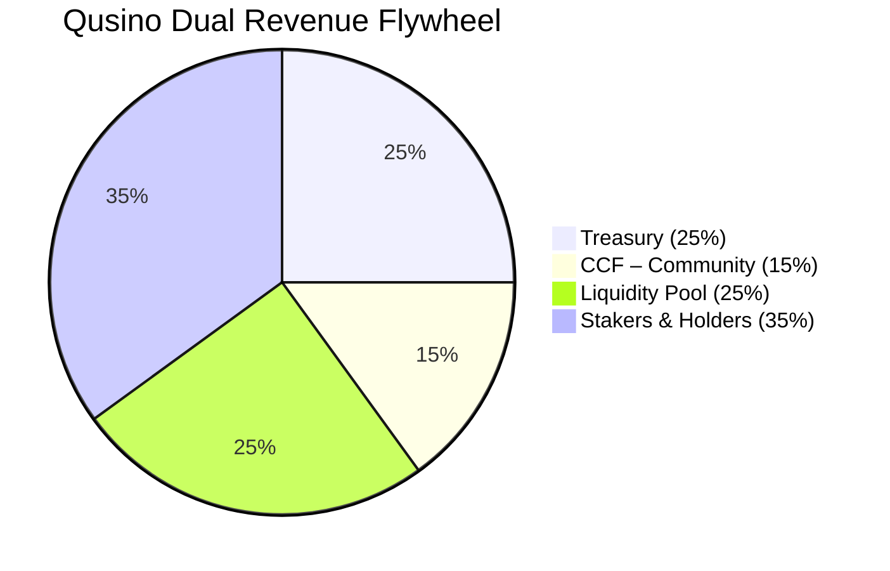

# Qusino Dual Model Architecture Outline

**Version**: 1.3 – Dual-Compliant | Geo-Routed | Global & US-Optimized

---

# Qusino: The Social, On-Chain, Player-Owned Casino (Dual Model)

**Play. Vote. Build. Own. Win.**

Qusino operates as a **dual-model platform** to ensure global accessibility and regulatory compliance:

- **Qusino.com (International Real-Money Casino)**: Licensed under the Isle of Man Gambling Supervision Commission (OGRA Act 2001). Offers real-money wagering via QUBIC blockchain for players outside restricted jurisdictions. Supports all games with fiat/crypto deposits, KYC-mandated withdrawals, and full on-chain fairness.
- **Qusino.us (US Social Sweepstakes Casino)**: Operates under US sweepstakes laws ("no purchase necessary" model). Uses **STAR** (fun play) and **Qs** (prize-eligible). Legal in 48 states (excl. ID, WA); redeem **Qs** winnings for cash/gifts post-verification. No real-money deposits—focus on free entry, bonuses, and social engagement.

**Geo-Routing**: Automatic IP-based redirection (US → Qusino.us; non-US → Qusino.com). VPN bypasses trigger compliance warnings. Shared backend for cross-model data sync (profiles, buddies, NFTs), with segregated wallets/tokens per model.

From daily login bonuses to **STAR/Qs-powered game governance**, NFT dividends, and admin-grade control — Qusino is fun first, fair always, and **fully on-chain** (where applicable).

**No gatekeepers. Just you, your buddies, and the floor.**

---

## Dual Model Overview

| Model | Domain | Jurisdiction/License | Currency Model | Key Features | Exclusions |
|-------|--------|----------------------|----------------|--------------|------------|
| **Real-Money (International)** | Qusino.com | Isle of Man (OGRA) – Covers all online gambling (casino, poker, betting; 5-year license, 0-1.5% tax on net profit) | QUBIC-native: **STAR** (utility), **Q** (redeemable 1:1) | Real stakes, crypto/fiat deposits, on-chain RNG/dividends | US, restricted territories |
| **Sweepstakes (US Social)** | Qusino.us | US Federal/State Sweepstakes Laws (no-purchase-necessary; compliant in 48 states) | Dual Virtual: **STAR** (fun-only, purchasable); **Qs** (prize-eligible, free via bonuses/mail-in) | Free play + cash redemptions (min. 100 **Qs**), social focus, no real-money wagering | ID, WA; real-money features |

**Compliance Hooks**:
- **KYC/AML**: Mandatory for redemptions >$2,000 (both models); Isle of Man standards for .com.
- **Age Gates**: 18+ (.us); 19+/21+ per state where stricter.
- **RNG**: On-chain `RANDOM.get()` for both; provably fair audits.
- **Shared Social Layer**: Buddies, chat, wall sync across models (geo-locked games).

---

## Phased Roadmap

| Phase | Milestones (Shared) | Real-Money (.com) | Sweepstakes (.us) |
|-------|---------------------|-------------------|--------------------|
| **Phase 1** | Frontend + API + Auth<br>Poker (Omaha, Texas Hold’em)<br>Social: Buddies, TL, Auto-Wall<br>Marketing Kit<br>Draft Dev API Docs<br>IPO Prep<br>**Launch Poker** | Real-stakes tables; QUBIC deposits | **STAR/Qs** play; free-entry promos |
| **Phase 2** | Game Launch Portal<br>First Slots<br>**STAR/Qs Voting + NFT Games** | On-chain voting (**STAR** burns) | Community voting (**Qs** entries); NFT prizes |
| **Phase 3** | Table Games<br>Qusino Marketplace | Real-NFT trading; dividends in **Q** | Virtual NFTs; redeemable prize packs |

**Dual Launch**: Qusino.com Q4 2025 (post-Isle license); Qusino.us Q1 2026 (US compliance audit).

---

## First-Time User Flow

**Geo-Routed Entry**:
- **Non-US (Qusino.com)**:
  ```
  Public Key/Fiat Login → Set @Username → **First Login Bonus**: 1,000 STAR + 100 Q → **Daily Login**: 500 STAR + 50 Q (7x streak) → Poker → Win → Dashboard → Congratulate → Cashier → Withdraw Q → QUBIC/Fiat (KYC) → > Threshold → Upload Docs → Verified → Paid → Logout
  ```
- **US (Qusino.us)**:
  ```
  Free Account Signup → Set @Username → **First Login Bonus**: 500K STAR + 50 Qs → **Daily Login**: 250K STAR + 25 Qs (7x streak) → Poker (STAR mode) → Switch to Qs → Win → Dashboard → Redeem Qs → Mail-In Option → Verified (ID check) → Cash/Gift → Logout
  ```

**No-Purchase-Necessary**: US users get free **Qs** via daily bonuses, social shares, or mail-in requests (e.g., postcard for 100 **Qs**).

---

## Tech Stack

| Layer | Technology | Dual Notes |
|-------|------------|------------|
| Frontend | HTMX + CSS + Animate.js | Responsive; geo-redirect via Cloudflare Workers |
| Real-Time | Socket.IO | Shared chat; model-segregated game rooms |
| Backend | Node.js + Express | Segregated APIs (.com vs .us); shared user DB |
| Auth | Auth.js (Public Key + 2FA) | .com: Crypto wallets; .us: Email/SMS + state ID |
| Blockchain | **QUBIC Tick Chain** | .com only; .us: Off-chain virtual ledgers w/ RNG hooks |
| RNG | `RANDOM` Smart Contract | On-chain for .com; certified PRNG for .us (auditable) |
| Smart Contracts | C++ (WASM) | .com: Full; .us: Hooks for prize draws only |

**Infrastructure**: AWS/GCP hybrid; CDNs for low-latency geo-routing.

---

## Token & Bonus System

| Model | Token/Currency | Value/Conversion | Acquisition |
|-------|----------------|------------------|-------------|
| **Real-Money (.com)** | **STAR** | `1 STAR = 1,000 QUBIC` | Deposit, Bonus, Marketplace |
| | **Q** | Redeemable for QUBIC (1:1 post-KYC) | 1 Q per STAR bought; 0.10 Q from giveaways |
| **Sweepstakes (.us)** | **STAR** | Fun-only (no redemption) | Purchases (entertainment packs), daily free |
| | **Qs** | Redeemable for cash/gifts (1:1, min. 100) | Free: Bonuses, mail-in, social; bonus w/ STAR buys |

### Bonus Giveaways (Model-Specific)

- **Real-Money (.com)**:
  - **First Login**: `1,000 STAR + 100 Q`
  - **Daily Login**: `500 STAR + 50 Q` → **Day 7 = 5,000 STAR + 500 Q**
  - **Social**: Add Buddy → `200 STAR` | Gift → `100 STAR` (both)
  - **Milestones**: First Win → `1,000 STAR`
- **Sweepstakes (.us)**:
  - **First Login**: `500K STAR + 50 Qs`
  - **Daily Login**: `250K STAR + 25 Qs` → **Day 7 = 2.5M STAR + 250 Qs**
  - **Social**: Add Buddy → `100K STAR + 10 Qs` | Gift → `50K STAR + 5 Qs` (both)
  - **Milestones**: First Win → `500K STAR + 50 Qs`

> .com: All bonuses minted via `BONUS.mint()` on-chain. .us: Virtual mints; compliant w/ free-entry rules.

---

## Social Wall

- **Auto-broadcast only**: `"William won 1BQ!"` (.com) / `"John hit jackpot in Qs!"` (.us)
- **Privacy toggles**: Hide game data, private profile
- **Feed**: Buddies first → big wins → Qusino Blog (shared; geo-flagged content)

**Cross-Model Sync**: US users see .com teasers (e.g., "Global wins"); non-US see .us social highlights.

---

## Profile | Chat | Dashboard | Cashier

| Feature | Details (.com) | Details (.us) |
|---------|----------------|----------------|
| **Profile** | Stats, History, Add/Block/MSG | Stats, History, Add/Block/MSG (virtual wins) |
| **Chat** | Global, DM, Group, In-Game | Global, DM, Group, In-Game (shared) |
| **Dashboard** | Sidebar + Notifications (Rewards, Gifts, Requests) | Sidebar + Notifications (Bonuses, **Qs**, Entries) |
| **Cashier** | QUBIC ↔ STAR, Q → QUBIC/Fiat (KYC), NFTs | **STAR/Qs** balances; Redeem **Qs** → Cash/Gift (ID verify); Mail-in portal |

---

## Game Launch Portal (Phase 2)

### Consensus Voting

- **Cost**: `1,000 STAR` (.com) / `50 Qs` (.us) burned/entered per vote
- **Cycle**: Mon 12:00 UTC → Sun 12:00 UTC
- **Threshold**: `50.01%`
- **Revotable**: Yes
- **Pass** → Floor | **Fail** → Archive

### Retirement

- **Triggers**: Sales ↓40%, Bugs, 18+ months
- **Process**: Vote → 1-week grace → Archive or **Crusher** (`NFT.burn()` .com; virtual burn .us)

**Dual Governance**: Shared votes influence both models; US votes weighted for social features.

---

## FULL API ENDPOINTS

**Base URL**: `https://api.qusino.com` (.com) / `https://api.qusino.us` (.us)  
**Auth**: `Bearer <jwt>`  
**WebSocket**: `wss://live.qusino.com` (.com) / `wss://live.qusino.us` (.us)

### Auth & Onboarding

| Method | Endpoint | Description (.com / .us) |
|--------|----------|--------------------------|
| `POST` | `/auth/login/key` | Public key login / Email signup |
| `POST` | `/auth/username` | Set @username (shared) |
| `POST` | `/bonus/first/claim` | 1,000 STAR + 100 Q / 500K STAR + 50 Qs |
| `POST` | `/bonus/daily/claim` | Daily reward |
| `POST` | `/auth/kyc/submit` | Upload docs (fiat/crypto) / ID for redemptions |
| `GET` | `/auth/kyc/status` | Check |

### User & Social (Shared)

| Method | Endpoint | Description |
|--------|----------|-------------|
| `GET` | `/user/me` | Profile (model-flagged) |
| `GET` | `/buddies` | List |
| `POST` | `/gifts/send` | Send STAR/NFT / STAR/Qs |
| `GET/POST` | `/chat/global` | Global chat |
| `GET/POST` | `/chat/dm/{id}` | DM |

### Poker & Games

| Method | Endpoint | Description (.com / .us) |
|--------|----------|--------------------------|
| `GET` | `/poker/rooms` | List (stakes / fun rooms) |
| `POST` | `/poker/rooms/{id}/join` | Join (Q bets / STAR/Qs) |
| `POST` | `/games/submit` | Submit NFT game |
| `POST` | `/games/{id}/vote` | Vote (1,000 STAR / 50 Qs) |
| `GET` | `/games/floor` | Live games |

### Marketplace (Phase 3)

| Method | Endpoint | Description (.com / .us) |
|--------|----------|--------------------------|
| `GET` | `/marketplace/games` | Listings (real NFTs / virtual) |
| `POST` | `/marketplace/buy/{id}` | Buy NFT |
| `POST` | `/marketplace/purchase/star` | Buy STAR / STAR pack (+ bonus Qs) |

### Cashier

| Method | Endpoint | Description (.com / .us) |
|--------|----------|--------------------------|
| `GET` | `/wallet/balances` | STAR, Q, NFTs / STAR, Qs |
| `POST` | `/wallet/deposit/qubic` | Convert / N/A (free only) |
| `POST` | `/wallet/withdraw/qubic` | Q → QUBIC (KYC) / Qs → Cash (verify) |
| `POST` | `/wallet/mailin/qs` | N/A / Request free Qs |

---

## ADMIN PORTAL – FULLY INTEGRATED

**Base URL**: `https://admin.qusino.com` (.com) / `https://admin.qusino.us` (.us)  
**Login Portal**: `https://admin.qusino.com` (global oversight; role-based access) (hardened)  
**Auth**: `Email + Password + 2FA (TOTP + FIDO2) + IP Whitelist`  
**Session**: 15 min expiry, full audit log

### Logs (Dual)

| Method | Endpoint | Description |
|--------|----------|-------------|
| `GET` | `/logs/activity` | User actions (model-filtered) |
| `GET` | `/logs/errors` | System/game errors |
| `GET` | `/logs/security` | Login/KYC |
| `GET` | `/logs/export` | CSV export |

### User Management (Dual)

| Method | Endpoint | Description (.com / .us) |
|--------|----------|--------------------------|
| `GET` | `/users` | Search (geo-tagged) |
| `GET` | `/users/{id}` | Full profile |
| `POST` | `/users/{id}/ban` | Ban (cross-model) |
| `POST` | `/users/{id}/kyc/approve` | Approve KYC/redemptions |
| `POST` | `/users/{id}/impersonate` | Login as |

### Game Management

| Method | Endpoint | Description |
|--------|----------|-------------|
| `GET` | `/games/voting` | Active votes (dual) |
| `POST` | `/games/{id}/launch` | Force launch |
| `POST` | `/games/{id}/retire/flag` | Flag for vote |
| `POST` | `/games/{id}/crush` | Burn NFT/virtual |

### Admin Management

| Method | Endpoint | Description |
|--------|----------|-------------|
| `GET` | `/admins` | List |
| `POST` | `/admins/create` | Invite |
| `POST` | `/admins/{id}/role` | Assign role (.com/.us/global) |
| `POST` | `/admins/{id}/remove` | Revoke |

### Token Management (Dual)

| Method | Endpoint | Description (.com / .us) |
|--------|----------|--------------------------|
| `POST` | `/tokens/mint/star` | Mint STAR / N/A |
| `POST` | `/tokens/bonus/distribute` | Manual drop (STAR/Q / STAR/Qs) |
| `POST` | `/dividends/trigger` | **Force weekly payout** (Q / Qs prizes) |

### System Settings

| Method | Endpoint | Description |
|--------|----------|-------------|
| `PATCH` | `/settings/kyc-threshold` | Set limit (dual) |
| `PATCH` | `/settings/bonus/daily` | Update reward |
| `POST` | `/settings/announcement` | Push blog (geo-targeted) |
| `POST` | `/settings/maintenance` | Toggle site (per model) |
| `POST` | `/settings/geo-rules` | Update routing/exclusions |

---

## WebSocket Events

| Event | Description |
|-------|-------------|
| `room:state` | Live game (model-specific) |
| `bonus:claimed` | Reward push |
| `vote:update` | Live tally |
| `admin:alert` | KYC flag, bug report, compliance breach |

---

## Smart Contract Hooks (.com Only; .us: Equivalent Off-Chain)

| Action | On-Chain/Process |
|--------|------------------|
| **RNG** | `RANDOM.get()` / Certified PRNG |
| **Vote** | Burn `1,000 STAR` / Enter `50 Qs` |
| **Bonus** | `BONUS.mint()` / Virtual credit |
| **Dividend** | **Weekly Q to NFT holders** / Qs prizes |
| **Crusher** | `NFT.burn()` / Virtual archive |

---

## Tokenomics & Revenue Redistribution (On-Chain Flywheel)

> **Every fee, rake, and yield is 100% distributed via smart contracts (.com) or compliant ledgers (.us) — no black boxes.**

| Recipient | Share | Purpose & Impact (.com / .us) |
|----------|-------|-------------------------------|
| **Qusino Treasury Fund** | **25%** | Core ops: salaries, audits, infra, R&D, compliance (Isle of Man fees / US legal) |
| **CCF (Community Contribution Fund)** | **15%** | Grants, bounties, integrations, governance |
| **In-dApp Liquidity Pool** | **25%** | Auto-injected into QUSINO/QUBIC pair / Virtual liquidity for **Qs** redemptions |
| **Shareholders (QUSINO Stakers & NFT Holders)** | **35%** | **Weekly dividends in Q**, buyback-and-burn, staking rewards / Prize pools from STAR sales |



**Deflationary by Design**:  
- **STAR/Qs** burned on votes/entries  
- $QUBIC burned as energy (.com)  
- NFT games crushed → supply reduction  
- Halving emissions every 52 epochs (QUBIC-native; .us: virtual scarcity via burns)

**US Revenue**: From **STAR** packs (entertainment only) + ads; 100% compliant w/ sweepstakes laws.

---

# The Future of Gaming Is Here

**Qusino isn’t a casino — it’s a movement.**

---

**Awaiting further instructions.**