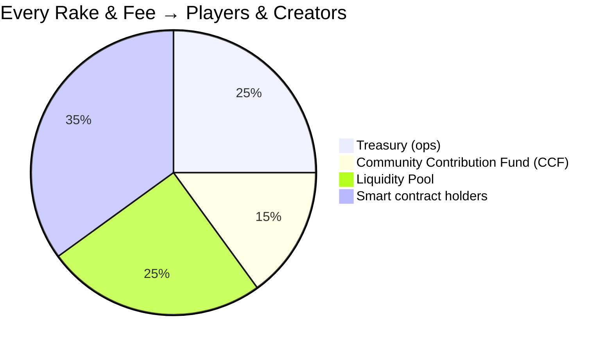

# Qusino – The First Player-Owned, On-Chain Casino on QUBIC  
**GitHub: https://github.com/nineisten/qusino** | Dual-Model v1.4 (QST/QSC) – LIVE DEV BUILD

### One Platform. Two Legal Models. Zero Gatekeepers.

**Qusino.com** → Global Real-Money Casino (Isle of Man OGRA license Q4 2025)  
**Qusino.us** → US Sweepstakes Casino (48 states legal – no purchase necessary)

Smart IP geo-routing. Same buddies, chat, wall, and profile across both worlds.

### Launching with Real Poker
- Texas Hold’em + Pot Limit Omaha (2–9 players)  
- 15–30s clock, rebuy, sit-out, auto-deal  
- In-game chat with emoji, @mentions, dealer notes, auto-mod  
- Provably fair via on-chain `RANDOM.get()`  
- Live support ticket → screenshot → agent in <60s

### Token Standard v1.4 – QST & QSC are now 1:1
| Model | Play Chip | Prize Token | Supply | Peg |
|-------|-----------|-------------|--------|-----|
| Global | STAR (1 STAR = 1,000 QUBIC) | **QST** – QUSINO STANDARD TOKEN | 1.8 B total | **1 QST = 1 QSC** (perfect cross-model parity) |
| US     | STAR (fun) | **QSC** – Qusino Sweepstakes Coin | Virtual | 100 QSC → cash/gift card (ID + free mail-in) |

**Day-one bonuses are still absurd:**  
- .com → 1,000 STAR + 100 **QST**  
- .us → **500K STAR + 50 QSC** (half a million free chips)

### Game Launch Portal – You Build It, You Own It Forever
Phase 2 (Q1 2026) drops the **first fully on-chain game submission portal** ever:

1. Submit your NFT game (slots, mines, crash, roulette, anything)  
2. Community votes: burn **1,000 STAR** (.com) or enter **50 QSC** (.us)  
3. 50.01% → auto-launched to the floor  
4. **Make royalties from the games you build** – forever  
5. Crush votes after 18 months → NFT burn → permanent supply deflation

**Devs, artists, degens – start shipping.**  
Full API spec, WebSocket events, smart-contract hooks, and admin impersonation tools will be available sooon.

### Revenue Flywheel – 100% Transparent & On-Chain

### Tech That Ships Fast
- HTMX + Socket.IO (zero framework bloat)  
- Node.js dual APIs (.com / .us)  
- Public-key + 2FA login (.com)  
- Complete admin portal: KYC approval, token minting, user impersonation  
- Cloudflare Workers geo-routing ready

### Timeline
- **Q4 2025** – Qusino.com poker launch (real stakes)  
- **Q1 2026** – Qusino.us + Game Launch Portal open for submissions  
- **Q3 2026** – Marketplace live, mobile apps, first 10 community games

### Devs: This is Your Casino
- Fork → build → submit → **earn royalties forever**  
- Open an issue with tag `game-submission` → instant 50 **QSC** testnet airdrop  
- Smart-contract templates in C++ WASM already in `/contracts`

### Players
Join the waitlist at https://qusino.com → lock in your **500K STAR + 50 QSC** on launch day.

♠️♦️♣️♥️ **Qusino – Play. Vote. Build. Own. Win.**  
Star this repo. Build the next hit game. See you at the tables.