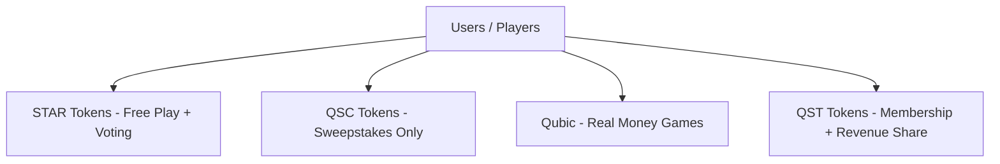
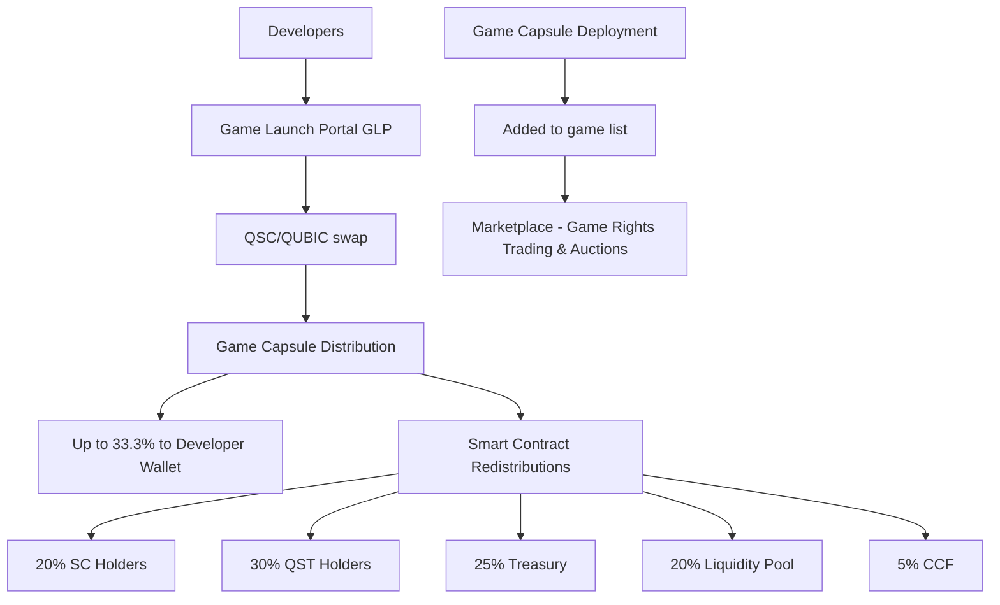
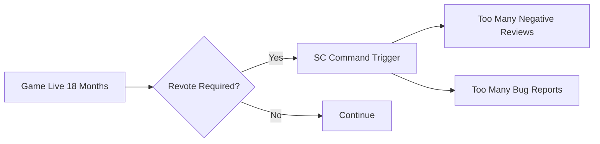
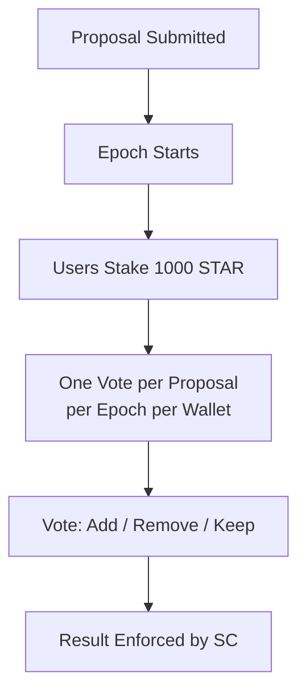
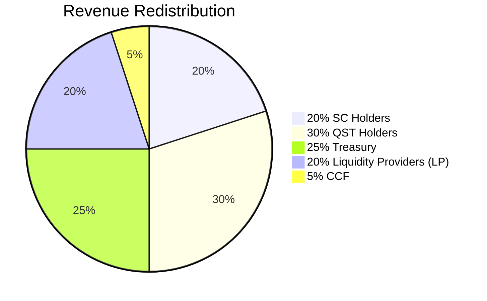

# Qusino Architecture  
**Q1/Q2 2026 Update**

## Executive Summary

Qusino is a decentralized gaming ecosystem built on the Qubic network that combines **free-to-play**, **sweepstakes**, and **real-money gaming** models under a single Game Launch Portal (GLP).  

The architecture emphasizes:
- Community governance via STAR token voting
- Provably fair gameplay (RANDOM RNG)
- Multiple revenue-sharing layers (developers, QST holders, liquidity providers, treasury, etc.)
- Tiered membership perks through holding QST
-  parallel in-game currencies with distinct utilities:
  - **STAR** → free play + voting power
  - **QSC** → sweepstakes entry/redemption

## 1. High-Level Ecosystem Overview

```mermaid
flowchart TD
    A[Users / Players] --> B[STAR Tokens - Free Play + Voting]
    A --> C[QSC Tokens - Sweepstakes Only]
    A --> D[Qubic - Real Money Games]
    A --> E[QST Tokens - Membership + Revenue Share]


```

```mermaid
flowchart TD
    F[Game Launch Portal GLP] --> G[QSC/QUBIC swap] --> H[Game Capsule Distribution]
    H--> HH[Up to 33.3% to Developer Wallet]
    H-->I[Smart Contract Redistributions]
    I --> J[20% SC Holders]
    I --> K[30% QST Holders]
    I --> L[25% Treasury]
    I --> M[20% Liquidity Pool]
    I --> N[5% CCF]

    O[Developers] --> F
    P[Game Capsule Deployment] --> Q[Added to game list]-->R[Marketplace - Game Rights Trading & Auctions]

    


```

## 2. Game Launch Portal (GLP)

### Key Rules
- **Launch Fee**: 100 million Qubic  
  → 10% automatically sent to Smart Contract (SC) reserve
- **Developer Workflow**:
  1. Build game
  2. Submit proposal (repo + playable demo)
  3. Community vote
  4. Deployed as NFT styled Capsule.
- **Automatic Revenue Split**: Up to **33.3%** to developer
- **Marketplace Features**:
  - Game rights trading
  - Game rights auctions

### Revote Triggers

```mermaid
flowchart LR
    A[Game Live 18 Months] --> B{Revote Required?}
    B -->|Yes| C[SC Command Trigger]
    B -->|No| D[Continue]
    C --> E[Too Many Negative Reviews]
    C --> F[Too Many Bug Reports]


```

### GLP Guidelines (Mandatory)
| Requirement                      | Details |
|----------------------------------|-------|
| Repository                       | Must be public & linked |
| Playable Demo                    | Included in proposal |
| RNG                              | Must use **RANDOM** for provably fair |
| Game Mode Selector               | Toggle between STAR (Free) / QSC or Qubic |
| Free Mode                        | Must include STAR play |
| Sweepstakes Model                | Use **QSC** via Qusino Command |
| Real Money Model                 | Use **Qubic** |

---

## 3. Voting System

```mermaid
flowchart TD
    A[Proposal Submitted] --> B[Epoch Starts]
    B --> C[Users Stake 1000 STAR]
    C --> D[One Vote per Proposal\nper Epoch per Wallet]
    D --> E[Vote: Add / Remove / Keep]
    E --> F[Result Enforced by SC]


```

- **Vote Cost**: 1000 STAR tokens (locked during epoch)
- **Revotes**: Can be forced by Smart Contract (negative reviews / bugs)

---

## 4. Smart Contract Redistributions

**Revenue Split (per game / platform earnings)**

```mermaid
pie title Revenue Redistribution
"20% SC Holders" : 20
"30% QST Holders" : 30
"25% Treasury" : 25
"20% Liquidity Providers (LP)" : 20
"5% CCF" : 5
```

---

## 5. Tokens

### QST – Qusino Standard Token
- **Total Supply**: 1.8 billion
- **Utility**:
  - 30% of platform revenue
  - QUSINO Membership (Tier 1 / Tier 2 / Tier 3 perks)
  - Casino-style Player’s Card (more held = better perks)
  - Staking rewards paid in Qubic (1 QST : Dividends × interest)

#### QST Distribution Table
| Allocation          | %     | Amount    |
|---------------------|-------|-----------|
| QX Exchange         | 22%   | 396 M     |
| Reserve             | 17%   | 306 M     |
| Liquidity Pool (LP) | 24%   | 432 M     |
| In Circulation      | 2.7%  | 48 M      |
| Founder             | 1%    | 18 M      |
| **Burned**          | **33.3%** | **600 M** |
| **TOTAL**           | **100%** | **1.8 B** |

### QSC – Qusino Sweepstakes Coin
- **Price**: 120 Qubic each
- **Issuance**: 1 QSC issued daily (per eligible wallet)
- **Earning**: Bonuses from STAR purchases & staking
- **Redemption Rules**:
  - Must risk **20%** of QSC balance before eligible for redemption
- **Exclusive Use**: Sweepstakes games only

### STAR – Consensus Token
- **Purpose**:
  - Voting power
  - Access to free gameplay
- **Issuance**: 100 STAR issued daily
- **Conversion**: 100 STAR = 1 QSC bonus
- **Voting Requirement**: Minimum **1000 STAR** held to vote

---

## 6. Game Play Models Summary

| Model          | Currency | Access          | Revenue Model          |
|----------------|----------|-----------------|------------------------|
| **Free**       | STAR     | Free play       | None (ad / engagement) |
| **Sweepstakes**| QSC      | Bonuses / daily | Risk 20% for redemption|
| **Real Money** | Qubic    | Direct purchase | Full casino model      |

---

**End of Q2 2026 Architecture Outline**  
All flows, tables, and diagrams above are directly derived from the provided specification and are ready for implementation or presentation.