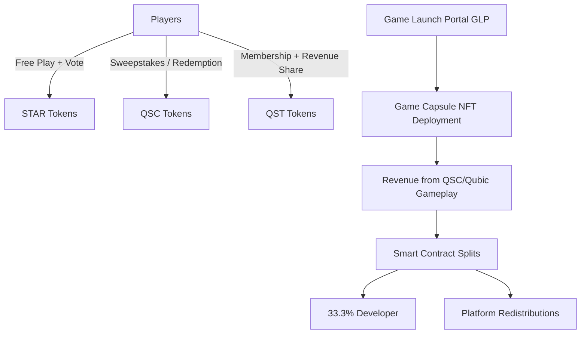
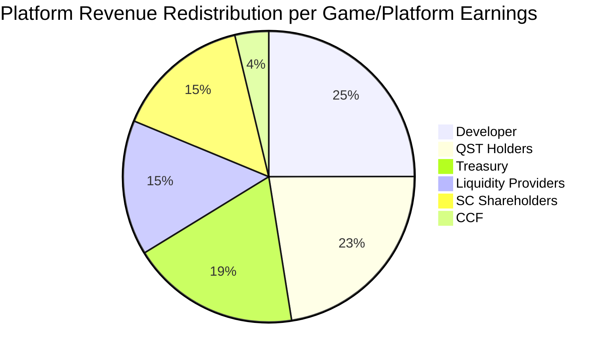
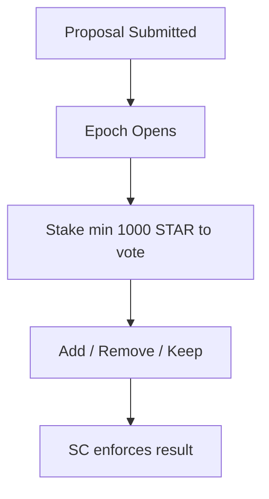

# Proposal to Include Qusino Smart Contract

**Proposal**  
Approve the deployment and integration of the Qusino ecosystem (Game Launch Portal, provably fair gaming capsules, multi-token model with STAR/QSC/QST) on the Qubic blockchain, including automatic revenue redistributions via smart contract.

**Available Options**  
- **Option 1:** Yes — Approve Qusino GLP deployment and ecosystem rules.  
- **Option 0:** No — Do not approve at this time.

---

## Executive Summary

Qusino is a decentralized gaming ecosystem built natively on Qubic, combining **free-to-play** (STAR tokens) and **sweepstakes-style** (QSC tokens) models through a community-governed **Game Launch Portal (GLP)**. It enables developers to deploy provably fair games as NFT-styled Capsules, with automatic revenue sharing (up to 33.3% to devs, plus splits to QST holders, treasury, liquidity providers, SC shareholders, and CCF). Governance occurs via STAR voting, membership perks scale with QST holdings, and all randomness uses the native RANDOM smart contract for transparency.

Approval enables real on-chain gaming activity, increases Qubic compute/asset usage, and bootstraps a revenue-generating vertical (gaming/gambling) with fair, transparent tokenomics.

---

## What problem does Qusino solve?

Qubic currently lacks native, standardized infrastructure for decentralized gaming platforms with:

- Provably fair RNG tied to RANDOM Smart Contract
- Multi-currency models (free vs. redeemable sweepstakes)
- Community-voted game inclusion/exclusion
- Multi-layer revenue sharing without centralized custodians
- Tiered perks and governance aligned with holding/staking

Qusino solves this by providing:

- A reusable **GLP smart contract framework** for capsule deployment
- **Mandatory provable fairness** via RANDOM
- **Transparent redistribution** (20% SC holders, 30% QST, 25% treasury, 20% LP, 5% CCF)
- **Voting revocation** for underperforming games (after 18 months or via negative reviews/bugs)
- **Native Qubic integration** for fees, swaps, and gameplay

---

## High-Level Ecosystem Overview

```mermaid
flowchart TD
    A[Players] -->|Free Play + Vote| B[STAR Tokens]
    A -->|Sweepstakes / Redemption| C[QSC Tokens]
    A -->|Membership + Revenue Share| D[QST Tokens]
    E[Game Launch Portal GLP] --> F[Game Capsule NFT Deployment]
    F --> G[Revenue from QSC/Qubic Gameplay]
    G --> H[Smart Contract Splits]
    H --> I[33.3% Developer]
    H --> J[Platform Redistributions]
```

```mermaid
pie title Platform Revenue Redistribution per Game/Platform Earnings
    "Developer" : 33.3
    "QST Holders" : 30
    "Treasury" : 25
    "Liquidity Providers" : 20
    "SC Shareholders" : 20
    "CCF" : 5
```

*Note: Developer cap at ~33.3%; remaining split among others as shown.*

---

## Game Launch Portal (GLP) Rules & Workflow

### Mandatory Guidelines

| Requirement              | Details                                                                 |
|--------------------------|-------------------------------------------------------------------------|
| Launch Fee               | 100 million Qubic (10% auto to SC reserve)                              |
| Repository               | Must be public GitHub repo                                              |
| Demo                     | Playable demo required in proposal                                      |
| RNG                      | MUST use RANDOM for provably fair outcomes                              |
| Mode Selector            | Toggle: STAR (free), QSC (sweepstakes), or direct Qubic                 |
| Free Mode                | Must support STAR play                                                  |
| Sweepstakes              | QSC via Qusino commands; risk 20% before redemption eligible           |
| Developer Revenue        | Up to 33.3% automatic                                                   |
| Marketplace              | Game rights tradable/auctionable post-launch                            |

### Developer / Capsule Deployment Flow

1. Build game with RANDOM integration
2. Submit proposal (repo + demo) to community vote (STAR holders)
3. If approved → pay 100M Qubic fee
4. Deploy as Capsule NFT
5. Live gameplay → revenue auto-split
6. After 18 months: optional revote (triggered by bugs/negative reviews)

---

## Voting System (for Game Inclusion/Removal)

```mermaid
flowchart TD
    P[Proposal Submitted] --> E[Epoch Opens]
    E --> V[Stake min 1000 STAR to vote]
    V --> Vote[Add / Remove / Keep]
    Vote --> Result[SC enforces result]
```

- Cost: 1000 STAR locked per epoch per proposal
- One vote per wallet per proposal per epoch
- Revote trigger: SC command after sustained negative feedback

---

## Tokens & Utilities

### QST – Membership & Revenue Token

Total supply: 1.8 billion (600M burned = 33.3%)  
Utility: Tiered membership (Player’s Card perks), 30% platform revenue share

| Allocation       | %     | Amount     |
|------------------|-------|------------|
| QX Exchange      | 22%   | 396M       |
| Reserve          | 17%   | 306M       |
| Liquidity Pool   | 24%   | 432M       |
| In Circulation   | 2.7%  | 48M        |
| Founder          | 1%    | 18M        |
| Burned           | 33.3% | 600M       |

### QSC – Sweepstakes Coin

- Fixed price: 120 Qubic  
- Daily issuance: 1 per eligible wallet  
- Bonus: STAR purchases → extra QSC  
- Redemption: Must risk ≥20% of balance first  

### STAR – Free Play & Governance Token

- Daily issuance: 100 per wallet  
- Bonus conversion: 100 STAR → 1 QSC bonus  
- Voting power: Min 1000 STAR to participate  

---

## Why approve Qusino on Qubic?

- Drives real usage: gaming transactions, asset creation, RANDOM calls  
- Fair & transparent: no off-chain custodians, provable via on-chain rules  
- Revenue flywheel: multi-layer sharing rewards holders, devs, liquidity  
- Community control: voting prevents spam/low-quality games  
- Positions Qubic as a leader in decentralized gaming/sweepstakes  

**Vote Recommendation: Option 1 – Yes Approve**  
Enable Qusino to launch capsules, activate gameplay, and distribute revenue on-chain — bringing sustainable activity to the network.
