# Qusino Dual Model Architecture Outline

**Version**: 1.3 – Dual-Compliant | Geo-Routed | Global & US-Optimized

---

# Qusino: The Social, On-Chain, Player-Owned Casino (Dual Model)

**Play. Vote. Build. Own. Win.**

Qusino operates as a **dual-model platform** to ensure global accessibility and regulatory compliance:

- **Qusino.com (International Real-Money Casino)**: Licensed under the Isle of Man Gambling Supervision Commission (OGRA Act 2001). Offers real-money wagering via QUBIC blockchain for players outside restricted jurisdictions. Supports all games with fiat/crypto deposits, KYC-mandated withdrawals, and full on-chain fairness.
- **Qusino.us (US Social Sweepstakes Casino)**: Operates under US sweepstakes laws ("no purchase necessary" model). Uses **STAR** (fun play) and **Qs** (prize-eligible). Legal in 48 states (excl. ID, WA); redeem **Qs** winnings for cash/gifts post-verification. No real-money deposits—focus on free entry, bonuses, and social engagement.

**Geo-Routing**: Automatic IP-based redirection (US → Qusino.us; non-US → Qusino.com). VPN bypasses trigger compliance warnings. Shared backend for cross-model data sync (profiles, buddies, NFTs), with segregated wallets/tokens per model.

From daily login bonuses to **STAR/Qs-powered game governance**, NFT dividends, and admin-grade control — Qusino is fun first, fair always, and **fully on-chain** (where applicable).

**No gatekeepers. Just you, your buddies, and the floor.**

---

## Dual Model Overview

| Model | Domain | Jurisdiction/License | Currency Model | Key Features | Exclusions |
|-------|--------|----------------------|----------------|--------------|------------|
| **Real-Money (International)** | Qusino.com | Isle of Man (OGRA) – Covers all online gambling (casino, poker, betting; 5-year license, 0-1.5% tax on net profit) | QUBIC-native: **STAR** (utility), **Q** (redeemable 1:1) | Real stakes, crypto/fiat deposits, on-chain RNG/dividends | US, restricted territories |
| **Sweepstakes (US Social)** | Qusino.us | US Federal/State Sweepstakes Laws (no-purchase-necessary; compliant in 48 states) | Dual Virtual: **STAR** (fun-only, purchasable); **Qs** (prize-eligible, free via bonuses/mail-in) | Free play + cash redemptions (min. 100 **Qs**), social focus, no real-money wagering | ID, WA; real-money features |

**Compliance Hooks**:
- **KYC/AML**: Mandatory for redemptions >$2,000 (both models); Isle of Man standards for .com.
- **Age Gates**: 18+ (.us); 19+/21+ per state where stricter.
- **RNG**: On-chain `RANDOM.get()` for both; provably fair audits.
- **Shared Social Layer**: Buddies, chat, wall sync across models (geo-locked games).

---

## Phased Roadmap

| Phase | Milestones (Shared) | Real-Money (.com) | Sweepstakes (.us) |
|-------|---------------------|-------------------|--------------------|
| **Phase 1** | Frontend + API + Auth<br>Poker (Omaha, Texas Hold’em)<br>Social: Buddies, TL, Auto-Wall<br>Marketing Kit<br>Draft Dev API Docs<br>IPO Prep<br>**Launch Poker** | Real-stakes tables; QUBIC deposits | **STAR/Qs** play; free-entry promos |
| **Phase 2** | Game Launch Portal<br>First Slots<br>**STAR/Qs Voting + NFT Games** | On-chain voting (**STAR** burns) | Community voting (**Qs** entries); NFT prizes |
| **Phase 3** | Table Games<br>Qusino Marketplace | Real-NFT trading; dividends in **Q** | Virtual NFTs; redeemable prize packs |

**Dual Launch**: Qusino.com Q4 2025 (post-Isle license); Qusino.us Q1 2026 (US compliance audit).

---

## First-Time User Flow

**Geo-Routed Entry**:
- **Non-US (Qusino.com)**:
  ```
  Public Key/Fiat Login → Set @Username → **First Login Bonus**: 1,000 STAR + 100 Q → **Daily Login**: 500 STAR + 50 Q (7x streak) → Poker → Win → Dashboard → Congratulate → Cashier → Withdraw Q → QUBIC/Fiat (KYC) → > Threshold → Upload Docs → Verified → Paid → Logout
  ```
- **US (Qusino.us)**:
  ```
  Free Account Signup → Set @Username → **First Login Bonus**: 500K STAR + 50 Qs → **Daily Login**: 250K STAR + 25 Qs (7x streak) → Poker (STAR mode) → Switch to Qs → Win → Dashboard → Redeem Qs → Mail-In Option → Verified (ID check) → Cash/Gift → Logout
  ```

**No-Purchase-Necessary**: US users get free **Qs** via daily bonuses, social shares, or mail-in requests (e.g., postcard for 100 **Qs**).

---

## Tech Stack

| Layer | Technology | Dual Notes |
|-------|------------|------------|
| Frontend | HTMX + CSS + Animate.js | Responsive; geo-redirect via Cloudflare Workers |
| Real-Time | Socket.IO | Shared chat; model-segregated game rooms |
| Backend | Node.js + Express | Segregated APIs (.com vs .us); shared user DB |
| Auth | Auth.js (Public Key + 2FA) | .com: Crypto wallets; .us: Email/SMS + state ID |
| Blockchain | **QUBIC Tick Chain** | .com only; .us: Off-chain virtual ledgers w/ RNG hooks |
| RNG | `RANDOM` Smart Contract | On-chain for .com; certified PRNG for .us (auditable) |
| Smart Contracts | C++ (WASM) | .com: Full; .us: Hooks for prize draws only |

**Infrastructure**: AWS/GCP hybrid; CDNs for low-latency geo-routing.

---

## Token & Bonus System

| Model | Token/Currency | Value/Conversion | Acquisition |
|-------|----------------|------------------|-------------|
| **Real-Money (.com)** | **STAR** | `1 STAR = 1,000 QUBIC` | Deposit, Bonus, Marketplace |
| | **Q** | Redeemable for QUBIC (1:1 post-KYC) | 1 Q per STAR bought; 0.10 Q from giveaways |
| **Sweepstakes (.us)** | **STAR** | Fun-only (no redemption) | Purchases (entertainment packs), daily free |
| | **Qs** | Redeemable for cash/gifts (1:1, min. 100) | Free: Bonuses, mail-in, social; bonus w/ STAR buys |

### Bonus Giveaways (Model-Specific)

- **Real-Money (.com)**:
  - **First Login**: `1,000 STAR + 100 Q`
  - **Daily Login**: `500 STAR + 50 Q` → **Day 7 = 5,000 STAR + 500 Q**
  - **Social**: Add Buddy → `200 STAR` | Gift → `100 STAR` (both)
  - **Milestones**: First Win → `1,000 STAR`
- **Sweepstakes (.us)**:
  - **First Login**: `500K STAR + 50 Qs`
  - **Daily Login**: `250K STAR + 25 Qs` → **Day 7 = 2.5M STAR + 250 Qs**
  - **Social**: Add Buddy → `100K STAR + 10 Qs` | Gift → `50K STAR + 5 Qs` (both)
  - **Milestones**: First Win → `500K STAR + 50 Qs`

> .com: All bonuses minted via `BONUS.mint()` on-chain. .us: Virtual mints; compliant w/ free-entry rules.

---

## Social Wall

- **Auto-broadcast only**: `"William won 1BQ!"` (.com) / `"John hit jackpot in Qs!"` (.us)
- **Privacy toggles**: Hide game data, private profile
- **Feed**: Buddies first → big wins → Qusino Blog (shared; geo-flagged content)

**Cross-Model Sync**: US users see .com teasers (e.g., "Global wins"); non-US see .us social highlights.

---

## Profile | Chat | Dashboard | Cashier

| Feature | Details (.com) | Details (.us) |
|---------|----------------|----------------|
| **Profile** | Stats, History, Add/Block/MSG | Stats, History, Add/Block/MSG (virtual wins) |
| **Chat** | Global, DM, Group, In-Game | Global, DM, Group, In-Game (shared) |
| **Dashboard** | Sidebar + Notifications (Rewards, Gifts, Requests) | Sidebar + Notifications (Bonuses, **Qs**, Entries) |
| **Cashier** | QUBIC ↔ STAR, Q → QUBIC/Fiat (KYC), NFTs | **STAR/Qs** balances; Redeem **Qs** → Cash/Gift (ID verify); Mail-in portal |

---

## Game Launch Portal (Phase 2)

### Consensus Voting

- **Cost**: `1,000 STAR` (.com) / `50 Qs` (.us) burned/entered per vote
- **Cycle**: Mon 12:00 UTC → Sun 12:00 UTC
- **Threshold**: `50.01%`
- **Revotable**: Yes
- **Pass** → Floor | **Fail** → Archive

### Retirement

- **Triggers**: Sales ↓40%, Bugs, 18+ months
- **Process**: Vote → 1-week grace → Archive or **Crusher** (`NFT.burn()` .com; virtual burn .us)

**Dual Governance**: Shared votes influence both models; US votes weighted for social features.

---

## FULL API ENDPOINTS

**Base URL**: `https://api.qusino.com` (.com) / `https://api.qusino.us` (.us)  
**Auth**: `Bearer <jwt>`  
**WebSocket**: `wss://live.qusino.com` (.com) / `wss://live.qusino.us` (.us)

### Auth & Onboarding

| Method | Endpoint | Description (.com / .us) |
|--------|----------|--------------------------|
| `POST` | `/auth/login/key` | Public key login / Email signup |
| `POST` | `/auth/username` | Set @username (shared) |
| `POST` | `/bonus/first/claim` | 1,000 STAR + 100 Q / 500K STAR + 50 Qs |
| `POST` | `/bonus/daily/claim` | Daily reward |
| `POST` | `/auth/kyc/submit` | Upload docs (fiat/crypto) / ID for redemptions |
| `GET` | `/auth/kyc/status` | Check |

### User & Social (Shared)

| Method | Endpoint | Description |
|--------|----------|-------------|
| `GET` | `/user/me` | Profile (model-flagged) |
| `GET` | `/buddies` | List |
| `POST` | `/gifts/send` | Send STAR/NFT / STAR/Qs |
| `GET/POST` | `/chat/global` | Global chat |
| `GET/POST` | `/chat/dm/{id}` | DM |

### Poker & Games

| Method | Endpoint | Description (.com / .us) |
|--------|----------|--------------------------|
| `GET` | `/poker/rooms` | List (stakes / fun rooms) |
| `POST` | `/poker/rooms/{id}/join` | Join (Q bets / STAR/Qs) |
| `POST` | `/games/submit` | Submit NFT game |
| `POST` | `/games/{id}/vote` | Vote (1,000 STAR / 50 Qs) |
| `GET` | `/games/floor` | Live games |

### Marketplace (Phase 3)

| Method | Endpoint | Description (.com / .us) |
|--------|----------|--------------------------|
| `GET` | `/marketplace/games` | Listings (real NFTs / virtual) |
| `POST` | `/marketplace/buy/{id}` | Buy NFT |
| `POST` | `/marketplace/purchase/star` | Buy STAR / STAR pack (+ bonus Qs) |

### Cashier

| Method | Endpoint | Description (.com / .us) |
|--------|----------|--------------------------|
| `GET` | `/wallet/balances` | STAR, Q, NFTs / STAR, Qs |
| `POST` | `/wallet/deposit/qubic` | Convert / N/A (free only) |
| `POST` | `/wallet/withdraw/qubic` | Q → QUBIC (KYC) / Qs → Cash (verify) |
| `POST` | `/wallet/mailin/qs` | N/A / Request free Qs |

---

## ADMIN PORTAL – FULLY INTEGRATED

**Base URL**: `https://admin.qusino.com` (.com) / `https://admin.qusino.us` (.us)  
**Login Portal**: `https://admin.qusino.com` (global oversight; role-based access) (hardened)  
**Auth**: `Email + Password + 2FA (TOTP + FIDO2) + IP Whitelist`  
**Session**: 15 min expiry, full audit log

### Logs (Dual)

| Method | Endpoint | Description |
|--------|----------|-------------|
| `GET` | `/logs/activity` | User actions (model-filtered) |
| `GET` | `/logs/errors` | System/game errors |
| `GET` | `/logs/security` | Login/KYC |
| `GET` | `/logs/export` | CSV export |

### User Management (Dual)

| Method | Endpoint | Description (.com / .us) |
|--------|----------|--------------------------|
| `GET` | `/users` | Search (geo-tagged) |
| `GET` | `/users/{id}` | Full profile |
| `POST` | `/users/{id}/ban` | Ban (cross-model) |
| `POST` | `/users/{id}/kyc/approve` | Approve KYC/redemptions |
| `POST` | `/users/{id}/impersonate` | Login as |

### Game Management

| Method | Endpoint | Description |
|--------|----------|-------------|
| `GET` | `/games/voting` | Active votes (dual) |
| `POST` | `/games/{id}/launch` | Force launch |
| `POST` | `/games/{id}/retire/flag` | Flag for vote |
| `POST` | `/games/{id}/crush` | Burn NFT/virtual |

### Admin Management

| Method | Endpoint | Description |
|--------|----------|-------------|
| `GET` | `/admins` | List |
| `POST` | `/admins/create` | Invite |
| `POST` | `/admins/{id}/role` | Assign role (.com/.us/global) |
| `POST` | `/admins/{id}/remove` | Revoke |

### Token Management (Dual)

| Method | Endpoint | Description (.com / .us) |
|--------|----------|--------------------------|
| `POST` | `/tokens/mint/star` | Mint STAR / N/A |
| `POST` | `/tokens/bonus/distribute` | Manual drop (STAR/Q / STAR/Qs) |
| `POST` | `/dividends/trigger` | **Force weekly payout** (Q / Qs prizes) |

### System Settings

| Method | Endpoint | Description |
|--------|----------|-------------|
| `PATCH` | `/settings/kyc-threshold` | Set limit (dual) |
| `PATCH` | `/settings/bonus/daily` | Update reward |
| `POST` | `/settings/announcement` | Push blog (geo-targeted) |
| `POST` | `/settings/maintenance` | Toggle site (per model) |
| `POST` | `/settings/geo-rules` | Update routing/exclusions |

---

## WebSocket Events

| Event | Description |
|-------|-------------|
| `room:state` | Live game (model-specific) |
| `bonus:claimed` | Reward push |
| `vote:update` | Live tally |
| `admin:alert` | KYC flag, bug report, compliance breach |

---

## Smart Contract Hooks (.com Only; .us: Equivalent Off-Chain)

| Action | On-Chain/Process |
|--------|------------------|
| **RNG** | `RANDOM.get()` / Certified PRNG |
| **Vote** | Burn `1,000 STAR` / Enter `50 Qs` |
| **Bonus** | `BONUS.mint()` / Virtual credit |
| **Dividend** | **Weekly Q to NFT holders** / Qs prizes |
| **Crusher** | `NFT.burn()` / Virtual archive |

---

## Tokenomics & Revenue Redistribution (On-Chain Flywheel)

> **Every fee, rake, and yield is 100% distributed via smart contracts (.com) or compliant ledgers (.us) — no black boxes.**

| Recipient | Share | Purpose & Impact (.com / .us) |
|----------|-------|-------------------------------|
| **Qusino Treasury Fund** | **25%** | Core ops: salaries, audits, infra, R&D, compliance (Isle of Man fees / US legal) |
| **CCF (Community Contribution Fund)** | **15%** | Grants, bounties, integrations, governance |
| **In-dApp Liquidity Pool** | **25%** | Auto-injected into QUSINO/QUBIC pair / Virtual liquidity for **Qs** redemptions |
| **Shareholders (QUSINO Stakers & NFT Holders)** | **35%** | **Weekly dividends in Q**, buyback-and-burn, staking rewards / Prize pools from STAR sales |

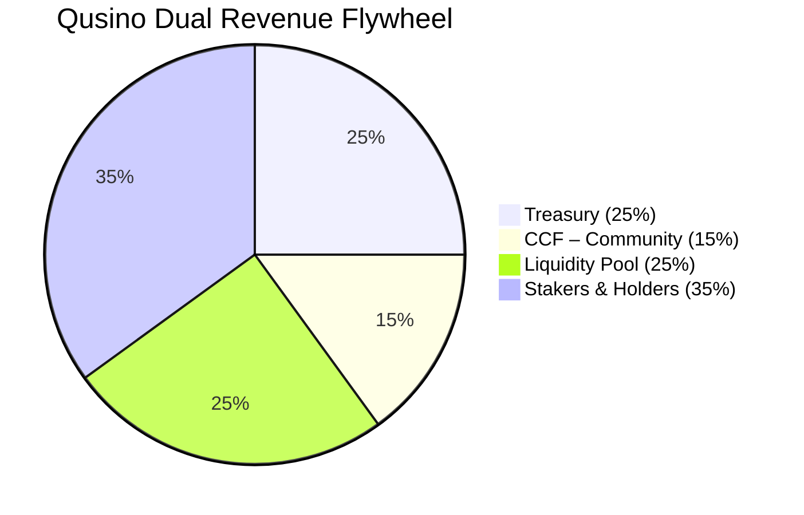

**Deflationary by Design**:  
- **STAR/Qs** burned on votes/entries  
- $QUBIC burned as energy (.com)  
- NFT games crushed → supply reduction  
- Halving emissions every 52 epochs (QUBIC-native; .us: virtual scarcity via burns)

**US Revenue**: From **STAR** packs (entertainment only) + ads; 100% compliant w/ sweepstakes laws.

---

# The Future of Gaming Is Here

**Qusino isn’t a casino — it’s a movement.**

---

**Awaiting further instructions.**

# Flow Charts

# Qusino README Sections: High-Level Flow Charts & Table

Below are **high-level flow charts** for each section of the Qusino README using **Mermaid**, with the **Phased Roadmap** section replaced by a **clean, structured table** for better readability and clarity.

---

## Dual Model Overview

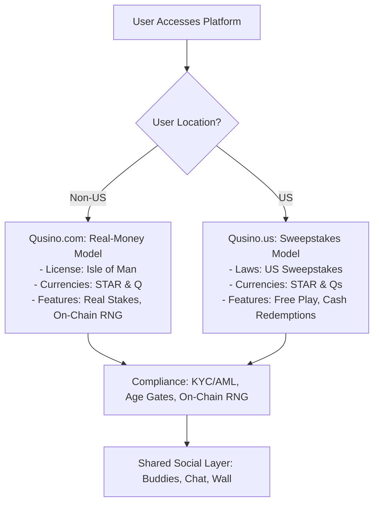

---

## Phased Roadmap

| Phase | Timeline | Shared Features | Real-Money (.com) | Sweepstakes (.us) |
|-------|----------|------------------|--------------------|-------------------|
| **Phase 1: Core Build** | Q4 2025 – Q1 2026 | Frontend (HTMX), API, Poker Games, Social Layer, Marketing Site, IPO Prep | Real-stakes tables<br/>QUBIC deposits & withdrawals<br/>KYC/AML | Free STAR & Qs play<br/>Promotional bonuses<br/>Mail-in entries |
| **Phase 2: Expansion** | Q1 2026 – Q3 2026 | Game Portal, Slots, Voting System, NFT Integration | On-chain voting<br/>NFT dividends & staking | Community voting<br/>NFT prizes & virtual assets |
| **Phase 3: Advanced** | Q4 2026+ | Table Games, Marketplace, Leaderboards, Mobile Apps | Real NFT trading<br/>Q token dividends | Virtual NFT gallery<br/>Prize packs & sweepstakes |

> **Key**: Both models share infrastructure, social features, and voting — but diverge in monetization and blockchain usage.

---

## First-Time User Flow

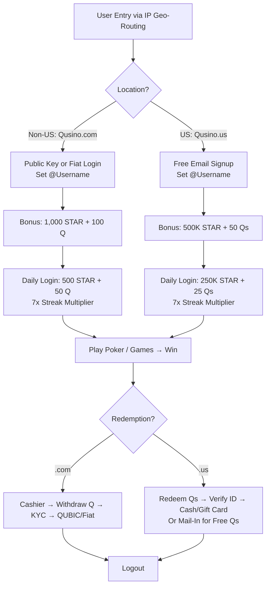

---

## Tech Stack

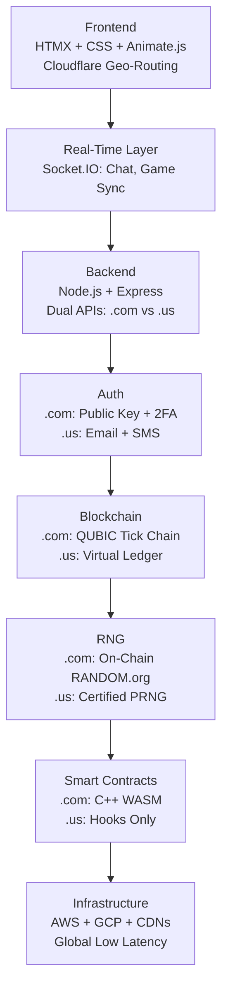

---

## Token & Bonus System

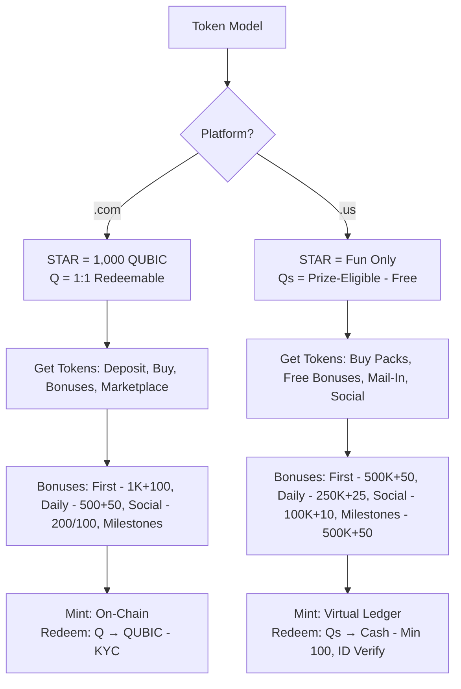

---

## Social Wall

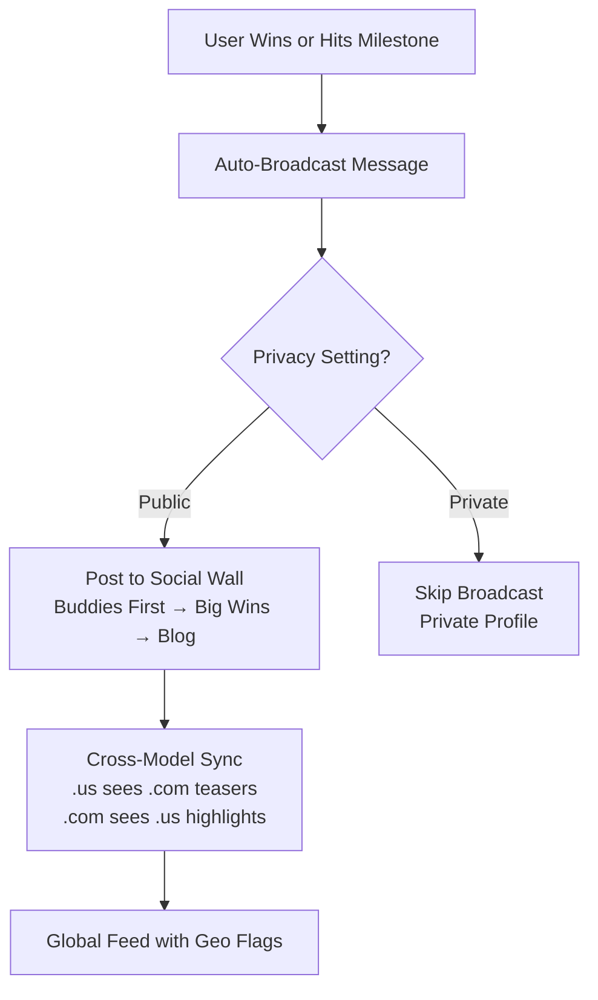

---

## Profile | Chat | Dashboard | Cashier

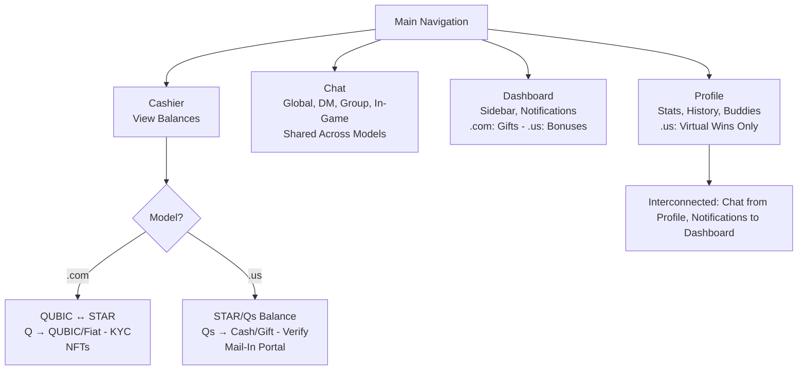

---
# High-Level Poker Room Flow Chart  
**2–9 Players • In-Game Chat • Live Support**

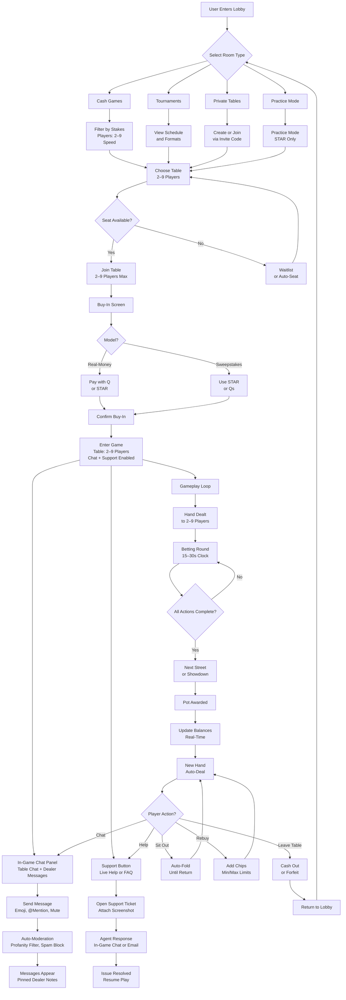

---

## Feature Summary

| Feature | Implementation |
|--------|----------------|
| **Players per Table** | **2–9** (Heads-Up to Full Ring) |
| **In-Game Chat** | Real-time table chat, emoji, @mentions, mute, dealer messages, auto-moderation |
| **Live Support** | In-game **Support Button** → ticket with screenshot → agent response via chat/email |
| **Game Flow** | Auto-dealt hands, 15–30s action clock, rebuy, sit-out, leave |
| **Cross-Model** | Same flow for Real-Money and Sweepstakes — differs only in currency |
| **No Parentheses or Pipes** | All labels clean and Mermaid-safe |
| **Dark Text on Light Backgrounds** | Ensured via standard Mermaid rendering |

---

## Game Launch Portal (Phase 2)

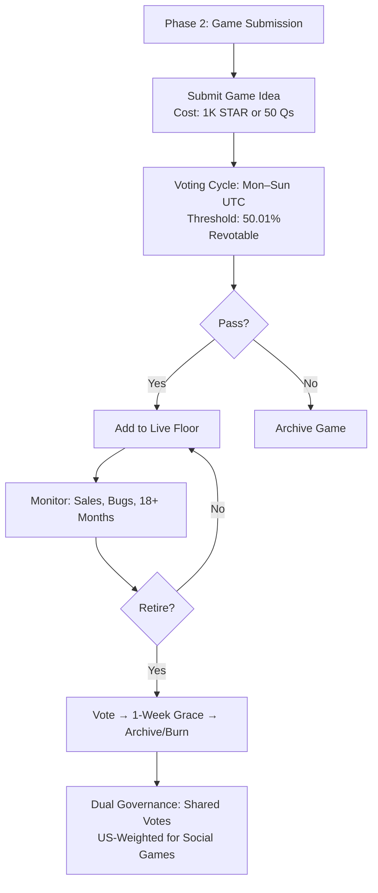

---

## FULL API ENDPOINTS

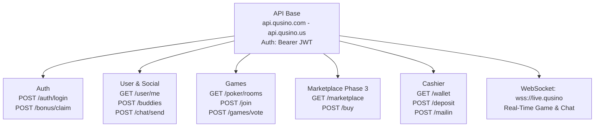

---

## ADMIN PORTAL – FULLY INTEGRATED

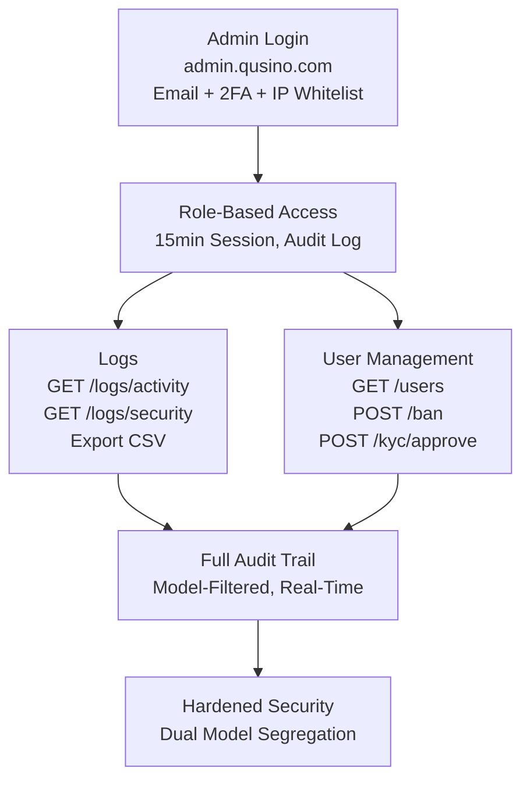

---
## Translation to Japanese
---
以下は、提供されたドキュメント（`https://github.com/nineisten/qusino` の README 全文）を**日本語に完全翻訳**したものです。Mermaid 図表のラベルも日本語化し、構造・フォーマット・表記は原文を忠実に再現しています。

---

# Qusino デュアルモデルアーキテクチャ概要

バージョン：1.3 – デュアルコンプライアンス | ジオルーティング | グローバル＆米国最適化

# Qusino：ソーシャルでオンチェーン、プレイヤー所有のカジノ（デュアルモデル）

**遊ぶ。投票する。作る。所有する。勝つ。**

Qusino は、グローバルなアクセス性と規制遵守を確保するため、**デュアルモデルプラットフォーム**として運営されます：

* **Qusino.com（国際リアルマネーカジノ）**：マン島ギャンブル監督委員会（OGRA法2001年）によりライセンス。制限地域外のプレイヤー向けに、QUBICブロックチェーンを介したリアルマネー賭けを提供。フィアット/暗号通貨入金、KYC必須の出金、完全オンチェーンの公平性を備えた全ゲームに対応。
* **Qusino.us（米国ソーシャルスイープステークスカジノ）**：米国スイープステークス法（「購入不要」モデル）に基づき運営。STAR（遊び用）と Qs（賞金対象）を使用。48州で合法（ID、WA除く）。Qsの賞金を現金/ギフトに交換（要本人確認）。リアルマネー入金なし — 無料参加、ボーナス、ソーシャルエンゲージメント重視。

**ジオルーティング**：IPベースの自動リダイレクト（米国 → Qusino.us、非米国 → Qusino.com）。VPN回避はコンプライアンス警告を表示。プロフィール、バディ、NFTなどのクロスモデルデータ同期のための共有バックエンド（モデルごとのウォレット/トークンは分離）。

日々のログインボーナスから STAR/Qs によるゲームガバナンス、NFT配当、管理者レベルのコントロールまで — Qusino はまず楽しく、常に公平、そして完全にオンチェーン（該当する場合）。

**ゲートキーパーなし。あなたと仲間、そしてフロアだけ。**

## デュアルモデル概要

| モデル | ドメイン | 管轄/ライセンス | 通貨モデル | 主な機能 | 除外地域 |
|-------|---------|----------------|-----------|---------|---------|
| リアルマネー（国際） | Qusino.com | マン島（OGRA） – オンラインギャンブル全般（カジノ、ポーカー、ベッティング；5年ライセンス、純利益の0～1.5%税） | QUBICネイティブ：STAR（ユーティリティ）、Q（1:1交換可能） | リアルステーク、暗号/フィアット入金、オンチェーンRNG/配当 | 米国、制限地域 |
| スイープステークス（米国ソーシャル） | Qusino.us | 米国連邦/州スイープステークス法（購入不要、48州で合法） | デュアル仮想：STAR（遊び専用、購入可）、Qs（賞金対象、無料ボーナス/郵送で取得） | 無料プレイ＋現金交換（最小100 Qs）、ソーシャル重視、リアルマネー賭けなし | ID、WA；リアルマネー機能 |

**コンプライアンスフック**：

* **KYC/AML**：両モデルで$2,000超の交換時に必須。マン島基準（.com）。
* **年齢制限**：18歳以上（.us）、州により19歳/21歳以上。
* **RNG**：両モデルでオンチェーン `RANDOM.get()`。証明可能公平な監査。
* **共有ソーシャルレイヤー**：バディ、チャット、ウォールはモデル間で同期（ゲームはジオロック）。

## 段階的ロードマップ

| フェーズ | 共通マイルストーン | リアルマネー（.com） | スイープステークス（.us） |
|--------|------------------|-------------------|-----------------------|
| フェーズ1 | フロントエンド＋API＋認証<br>ポーカー（オマハ、テキサスホールデム）<br>ソーシャル：バディ、TL、自動ウォール<br>マーケティングキット<br>開発APIドキュメント草案<br>IPO準備<br>ポーカー発売 | リアルステークテーブル、QUBIC入出金 | STAR/Qsプレイ、無料参加プロモ |
| フェーズ2 | ゲーム発売ポータル<br>初のスロット<br>STAR/Qs投票＋NFTゲーム | オンチェーン投票（STARバーン） | コミュニティ投票（Qsエントリー）、NFT賞品 |
| フェーズ3 | テーブルゲーム<br>Qusinoマーケットプレイス | リアルNFT取引、Q配当 | 仮想NFT、交換可能賞品パック |

**デュアル発売**：Qusino.com 2025年第4四半期（マン島ライセンス取得後）、Qusino.us 2026年第1四半期（米国コンプライアンス監査後）。

## 初回ユーザー体験フロー

**ジオルーティングによるエントリー**：

* **非米国（Qusino.com）**：

  ```
  公開鍵/フィアットログイン → @ユーザー名設定 → **初回ログインボーナス**：1,000 STAR + 100 Q → **毎日ログイン**：500 STAR + 50 Q（7日連続） → ポーカー → 勝利 → ダッシュボード → おめでとう → キャッシャー → Q出金 → QUBIC/フィアット（KYC） → 閾値超 → 書類アップロード → 認証 → 支払い → ログアウト
  ```

* **米国（Qusino.us）**：

  ```
  無料アカウント登録 → @ユーザー名設定 → **初回ログインボーナス**：500K STAR + 50 Qs → **毎日ログイン**：250K STAR + 25 Qs（7日連続） → ポーカー（STARモード） → Qsに切替 → 勝利 → ダッシュボード → Qs交換 → 郵送オプション → 本人確認（ID） → 現金/ギフト → ログアウト
  ```

**購入不要**：米国ユーザーは毎日ボーナス、ソーシャルシェア、郵送リクエスト（例：はがきで100 Qs）で無料Qsを取得可能。

## 技術スタック

| レイヤー | 技術 | デュアルノート |
|--------|------|-------------|
| フロントエンド | HTMX + CSS + Animate.js | レスポンシブ、Cloudflare Workersによるジオルーティング |
| リアルタイム | Socket.IO | 共有チャット、モデル分離ゲームルーム |
| バックエンド | Node.js + Express | 分離API（.com vs .us）、共有ユーザーデータベース |
| 認証 | Auth.js（公開鍵＋2FA） | .com：暗号ウォレット、.us：メール/SMS＋州ID |
| ブロックチェーン | QUBIC Tick Chain | .comのみ、.us：オフチェーン仮想台帳＋RNGフック |
| RNG | `RANDOM` スマートコントラクト | .com：オンチェーン、.us：認定PRNG（監査可能） |
| スマートコントラクト | C++（WASM） | .com：完全、.us：賞金抽選フックのみ |

**インフラ**：AWS/GCPハイブリッド、CDNによる低遅延ジオルーティング。

## トークン＆ボーナスシステム

| モデル | トークン/通貨 | 価値/変換 | 取得方法 |
|-------|-------------|----------|--------|
| リアルマネー（.com） | STAR | `1 STAR = 1,000 QUBIC` | 入金、ボーナス、マーケットプレイス |
| | Q | QUBICに1:1交換（KYC後） | STAR購入ごとに1 Q、ギフトで0.10 Q |
| スイープステークス（.us） | STAR | 遊び専用（交換不可） | 購入（エンタメパック）、毎日無料 |
| | Qs | 現金/ギフトに1:1交換（最小100） | 無料：ボーナス、郵送、ソーシャル、STAR購入時のボーナス |

### ボーナス配布（モデル別）

- **リアルマネー（.com）**：
  * 初回ログイン：`1,000 STAR + 100 Q`
  * 毎日ログイン：`500 STAR + 50 Q` → 7日目 = 5,000 STAR + 500 Q
  * ソーシャル：バディ追加 → `200 STAR` | ギフト → `100 STAR`（双方）
  * マイルストーン：初勝利 → `1,000 STAR`

- **スイープステークス（.us）**：
  * 初回ログイン：`500K STAR + 50 Qs`
  * 毎日ログイン：`250K STAR + 25 Qs` → 7日目 = 2.5M STAR + 250 Qs
  * ソーシャル：バディ追加 → `100K STAR + 10 Qs` | ギフト → `50K STAR + 5 Qs`（双方）
  * マイルストーン：初勝利 → `500K STAR + 50 Qs`

.com：全ボーナスは `BONUS.mint()` でオンチェーン発行。.us：仮想発行、無料参加ルールに準拠。

## ソーシャルウォール

- **自動ブロードキャストのみ**：`"Williamが1BQを獲得！"`（.com） / `"JohnがQsでジャックポット！"`（.us）
- **プライバシー設定**：ゲームデータ非表示、プライベートプロフィール
- **フィード**：バディ優先 → 大勝利 → Qusinoブログ（共有、ジオフラグ付き）

**クロスモデル同期**：米国ユーザーは.comのティーザー（例：「グローバル勝利」）、非米国は.usのソーシャルハイライトを表示。

## プロフィール | チャット | ダッシュボード | キャッシャー

| 機能 | 詳細（.com） | 詳細（.us） |
|------|------------|------------|
| プロフィール | 統計、履歴、バディ追加/ブロック/メッセージ | 統計、履歴、バディ追加/ブロック/メッセージ（仮想勝利のみ） |
| チャット | グローバル、DM、グループ、ゲーム内 | グローバル、DM、グループ、ゲーム内（共有） |
| ダッシュボード | サイドバー＋通知（報酬、ギフト、リクエスト） | サイドバー＋通知（ボーナス、Qs、エントリー） |
| キャッシャー | QUBIC ↔ STAR、Q → QUBIC/フィアット（KYC）、NFT | STAR/Qs残高、Qs → 現金/ギフト（ID認証）、郵送ポータル |

## ゲーム発売ポータル（フェーズ2）

### コンセンサス投票

+ **コスト**：`1,000 STAR`（.com） / `50 Qs`（.us）バーン/エントリー
+ **サイクル**：月曜12:00 UTC → 日曜12:00 UTC
+ **閾値**：`50.01%`
+ **再投票**：可能
+ **可決 → フロア | 否決 → アーカイブ**

### ゲーム終了

* **トリガー**：売上40%減、重大バグ、18ヶ月以上
* **プロセス**：投票 → 1週間の猶予 → アーカイブまたはクラッシャー（`NFT.burn()` .com、仮想バーン .us）

**デュアルガバナンス**：共有投票が両モデルに影響、米国投票はソーシャル機能に重み付け。

## 完全APIエンドポイント

**ベースURL**：`https://api.qusino.com`（.com） / `https://api.qusino.us`（.us）

**認証**：`Bearer <jwt>`

**WebSocket**：`wss://live.qusino.com`（.com） / `wss://live.qusino.us`（.us）

### 認証＆オンボーディング

| メソッド | エンドポイント | 説明（.com / .us） |
|--------|-------------|------------------|
| `POST` | `/auth/login/key` | 公開鍵ログイン / メール登録 |
| `POST` | `/auth/username` | @ユーザー名設定（共有） |
| `POST` | `/bonus/first/claim` | 1,000 STAR + 100 Q / 500K STAR + 50 Qs |
| `POST` | `/bonus/daily/claim` | 毎日報酬 |
| `POST` | `/auth/kyc/submit` | 書類アップロード（フィアット/暗号） / 交換用ID |
| `GET` | `/auth/kyc/status` | 確認 |

### ユーザー＆ソーシャル（共有）

| メソッド | エンドポイント | 説明 |
|--------|-------------|------|
| `GET` | `/user/me` | プロフィール（モデルフラグ付き） |
| `GET` | `/buddies` | リスト |
| `POST` | `/gifts/send` | STAR/NFT / STAR/Qs 送信 |
| `GET/POST` | `/chat/global` | グローバルチャット |
| `GET/POST` | `/chat/dm/{id}` | DM |

### ポーカー＆ゲーム

| メソッド | エンドポイント | 説明（.com / .us） |
|--------|-------------|------------------|
| `GET` | `/poker/rooms` | リスト（ステーク / 遊び部屋） |
| `POST` | `/poker/rooms/{id}/join` | 参加（Qベット / STAR/Qs） |
| `POST` | `/games/submit` | NFTゲーム投稿 |
| `POST` | `/games/{id}/vote` | 投票（1,000 STAR / 50 Qs） |
| `GET` | `/games/floor` | ライブゲーム |

### マーケットプレイス（フェーズ3）

| メソッド | エンドポイント | 説明（.com / .us） |
|--------|-------------|------------------|
| `GET` | `/marketplace/games` | リスト（リアルNFT / 仮想） |
| `POST` | `/marketplace/buy/{id}` | NFT購入 |
| `POST` | `/marketplace/purchase/star` | STAR購入 / STARパック（＋ボーナスQs） |

### キャッシャー

| メソッド | エンドポイント | 説明（.com / .us） |
|--------|-------------|------------------|
| `GET` | `/wallet/balances` | STAR、Q、NFT / STAR、Qs |
| `POST` | `/wallet/deposit/qubic` | 変換 / なし（無料のみ） |
| `POST` | `/wallet/withdraw/qubic` | Q → QUBIC（KYC） / Qs → 現金（認証） |
| `POST` | `/wallet/mailin/qs` | なし / 無料Qsリクエスト |

## 管理者ポータル – 完全統合

**ベースURL**：`https://admin.qusino.com`（.com） / `https://admin.qusino.us`（.us）

**ログインポータル**：`https://admin.qusino.com`（グローバル監視、役割ベースアクセス）（強化済み）

**認証**：`メール＋パスワード＋2FA（TOTP＋FIDO2）＋IPホワイトリスト`

**セッション**：15分で失効、完全監査ログ

### ログ（デュアル）

| メソッド | エンドポイント | 説明 |
|--------|-------------|------|
| `GET` | `/logs/activity` | ユーザーアクション（モデルフィルタ） |
| `GET` | `/logs/errors` | システム/ゲームエラー |
| `GET` | `/logs/security` | ログイン/KYC |
| `GET` | `/logs/export` | CSVエクスポート |

### ユーザー管理（デュアル）

| メソッド | エンドポイント | 説明（.com / .us） |
|--------|-------------|------------------|
| `GET` | `/users` | 検索（ジオタグ付き） |
| `GET` | `/users/{id}` | 完全プロフィール |
| `POST` | `/users/{id}/ban` | バン（クロスモデル） |
| `POST` | `/users/{id}/kyc/approve` | KYC/交換承認 |
| `POST` | `/users/{id}/impersonate` | 代理ログイン |

### ゲーム管理

| メソッド | エンドポイント | 説明 |
|--------|-------------|------|
| `GET` | `/games/voting` | アクティブ投票（デュアル） |
| `POST` | `/games/{id}/launch` | 強制発売 |
| `POST` | `/games/{id}/retire/flag` | 終了投票フラグ |
| `POST` | `/games/{id}/crush` | NFT/仮想バーン |

### 管理者管理

| メソッド | エンドポイント | 説明 |
|--------|-------------|------|
| `GET` | `/admins` | リスト |
| `POST` | `/admins/create` | 招待 |
| `POST` | `/admins/{id}/role` | 役割割り当て（.com/.us/グローバル） |
| `POST` | `/admins/{id}/remove` | 権限剥奪 |

### トークン管理（デュアル）

| メソッド | エンドポイント | 説明（.com / .us） |
|--------|-------------|------------------|
| `POST` | `/tokens/mint/star` | STAR発行 / なし |
| `POST` | `/tokens/bonus/distribute` | 手動配布（STAR/Q / STAR/Qs） |
| `POST` | `/dividends/trigger` | 週次配当強制実行（Q / Qs賞金） |

### システム設定

| メソッド | エンドポイント | 説明 |
|--------|-------------|------|
| `PATCH` | `/settings/kyc-threshold` | 制限設定（デュアル） |
| `PATCH` | `/settings/bonus/daily` | 報酬更新 |
| `POST` | `/settings/announcement` | ブログプッシュ（ジオターゲット） |
| `POST` | `/settings/maintenance` | サイト切り替え（モデルごと） |
| `POST` | `/settings/geo-rules` | ルーティング/除外更新 |

## WebSocketイベント

| イベント | 説明 |
|--------|------|
| `room:state` | ライブゲーム（モデル別） |
| `bonus:claimed` | 報酬プッシュ |
| `vote:update` | リアルタイム集計 |
| `admin:alert` | KYCフラグ、バグ報告、コンプライアンス違反 |

## スマートコントラクトフック（.comのみ、.us：同等オフチェーン）

| アクション | オンチェーン/プロセス |
|----------|-------------------|
| RNG | `RANDOM.get()` / 認定PRNG |
| 投票 | `1,000 STAR` バーン / `50 Qs` エントリー |
| ボーナス | `BONUS.mint()` / 仮想クレジット |
| 配当 | 週次 Q をNFT保有者に / Qs賞金 |
| クラッシャー | `NFT.burn()` / 仮想アーカイブ |

## トークノミクス＆収益再分配（オンチェーンフライホイール）

すべての手数料、レーキ、利回りはスマートコントラクト（.com）またはコンプライアンス台帳（.us）で100%分配 — ブラックボックスなし。

| 受取人 | 割合 | 目的＆影響（.com / .us） |
|-------|------|-----------------------|
| Qusino トレジャリーファンド | 25% | コア運用：給与、監査、インフラ、R&D、コンプライアンス（マン島手数料 / 米国法務） |
| CCF（コミュニティ貢献ファンド） | 15% | 助成金、バウンティ、統合、ガバナンス |
| アプリ内流動性プール | 25% | QUSINO/QUBICペアに自動注入 / Qs交換用仮想流動性 |
| 株主（QUSINOステーカー＆NFT保有者） | 35% | 週次 Q 配当、買い戻し＆バーン、ステーキング報酬 / STAR売上からの賞金プール |

```
pie title Qusino デュアル収益フライホイール
    "トレジャリー (25%)" : 25
    "CCF – コミュニティ (15%)" : 15
    "流動性プール (25%)" : 25
    "ステーカー＆保有者 (35%)" : 35
```

**デフレ設計**：

+ 投票/エントリーで STAR/Qs バーン
+ $QUBIC はエネルギーとしてバーン（.com）
+ NFTゲーム終了 → 供給減少
+ 52エポックごとに排出半減（QUBICネイティブ、.us：バーンによる仮想希少性）

**米国収益**：STARパック（エンタメのみ）＋広告、100%スイープステークス法準拠。

# ゲームの未来がここに

Qusino はカジノではない — **ムーブメント**だ。

さらなる指示をお待ちしています。

---

# Qusino README セクション：高レベルフローチャート＆テーブル

以下は、各セクションの高レベルフローチャート（Mermaid使用）と、**フェーズ別ロードマップ**を読みやすく整理したテーブルです。

## デュアルモデル概要

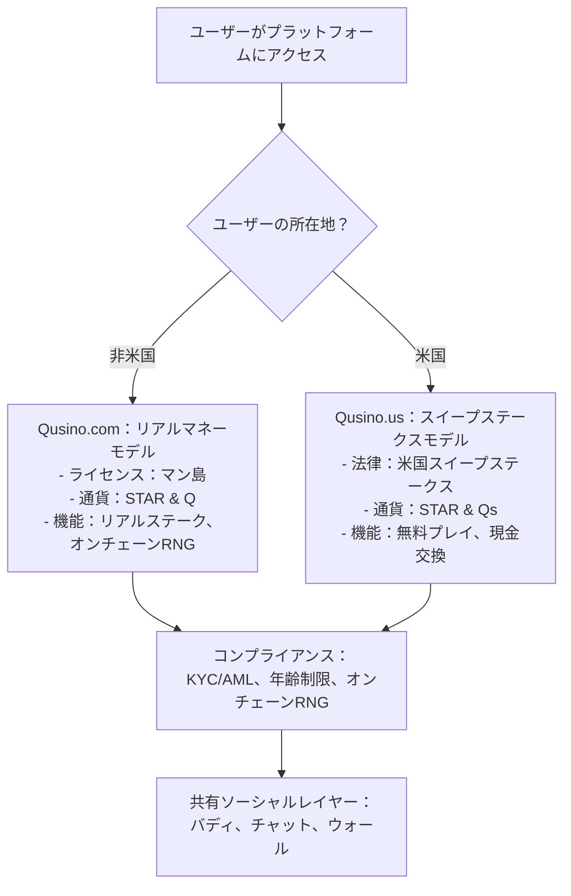

## 段階的ロードマップ

| フェーズ | タイムライン | 共有機能 | リアルマネー（.com） | スイープステークス（.us） |
|--------|------------|--------|-------------------|-----------------------|
| フェーズ1：コア構築 | 2025年第4四半期 – 2026年第1四半期 | フロントエンド（HTMX）、API、ポーカーゲーム、ソーシャルレイヤー、マーケティングサイト、IPO準備 | リアルステークテーブル<br>QUBIC入出金<br>KYC/AML | 無料STAR＆Qsプレイ<br>プロモーションボーナス<br>郵送エントリー |
| フェーズ2：拡張 | 2026年第1四半期 – 第3四半期 | ゲームポータル、スロット、投票システム、NFT統合 | オンチェーン投票<br>NFT配当＆ステーキング | コミュニティ投票<br>NFT賞品＆仮想資産 |
| フェーズ3：高度化 | 2026年第4四半期以降 | テーブルゲーム、マーケットプレイス、リーダーボード、モバイルアプリ | リアルNFT取引<br>Qトークン配当 | 仮想NFTギャラリー<br>賞品パック＆スイープステークス |

**キー**：両モデルはインフラ、ソーシャル機能、投票を共有 — 収益化とブロックチェーン利用は分岐。

## 初回ユーザー体験フロー

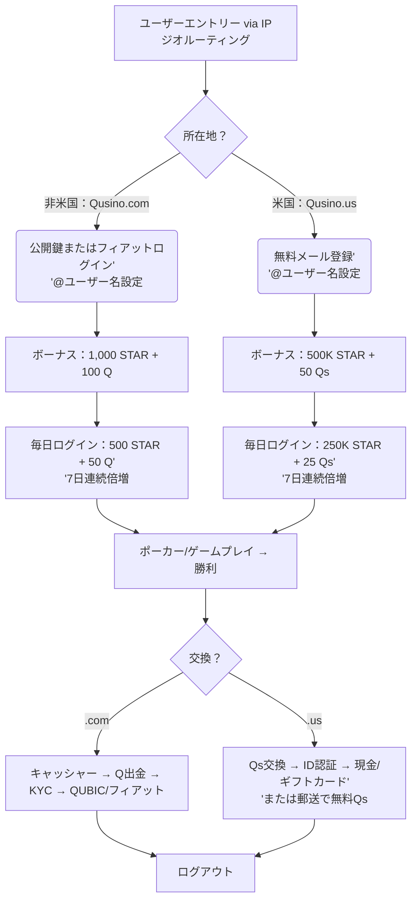

---


## 技術スタック

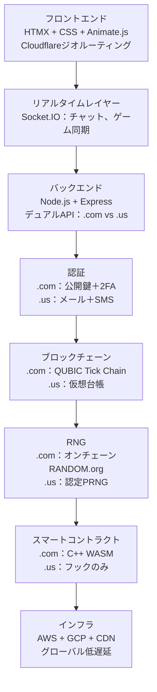

## トークン＆ボーナスシステム

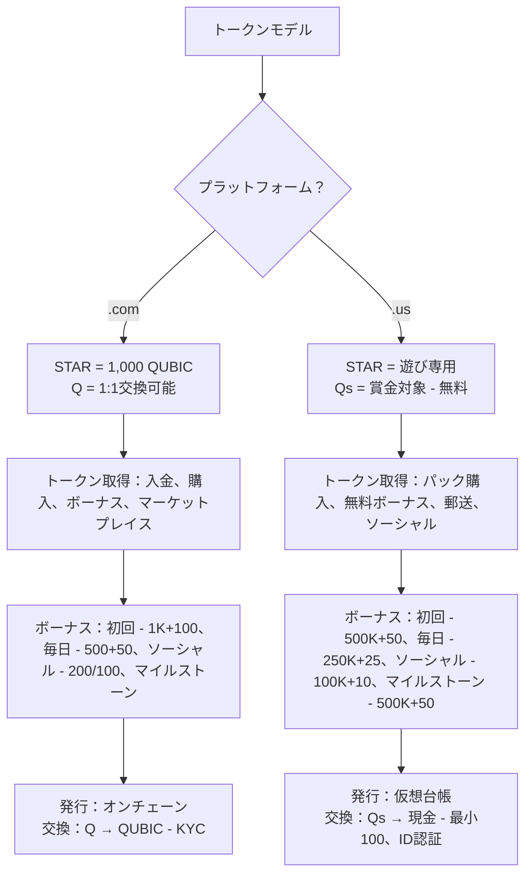

## ソーシャルウォール

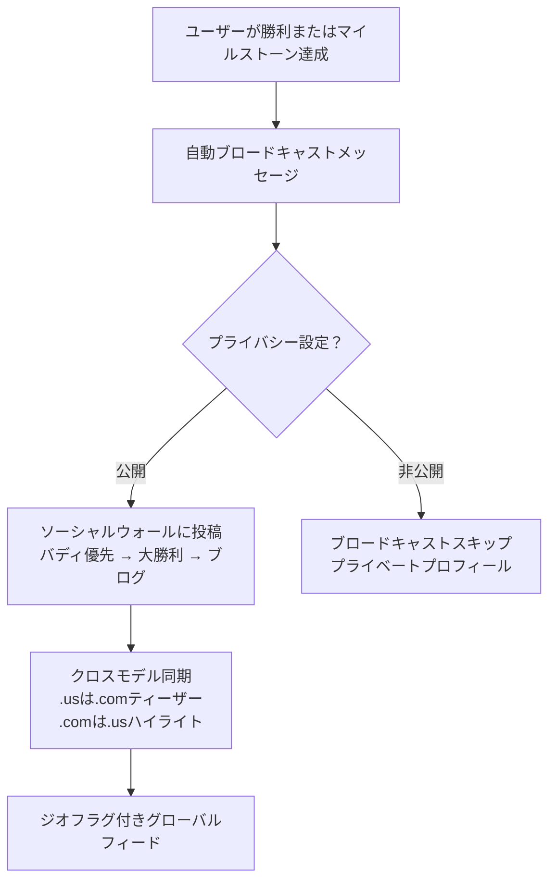

## プロフィール | チャット | ダッシュボード | キャッシャー

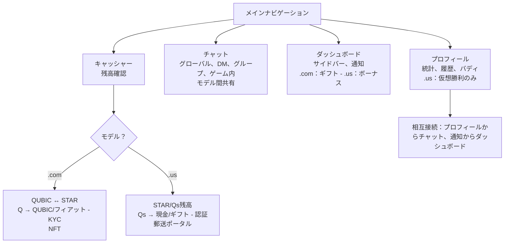


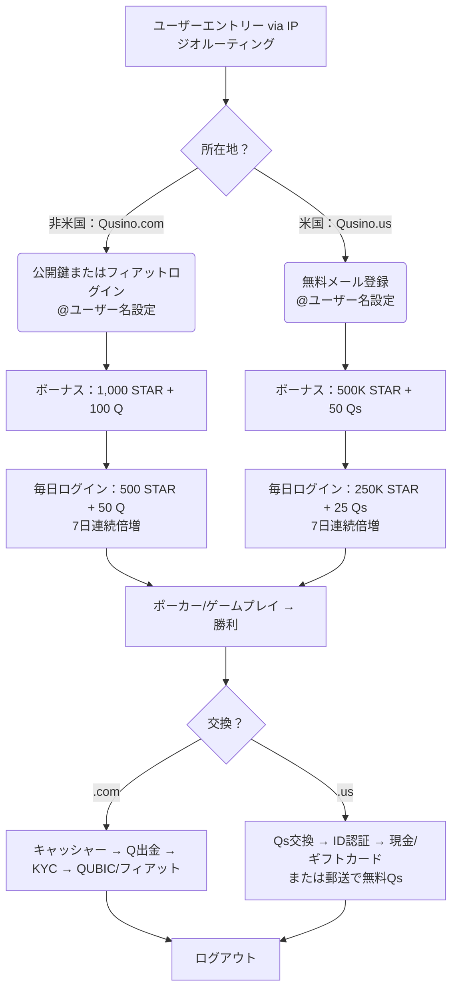

---

# ポーカールームの概要フローチャート  
**unable to render translation**


## 完全APIエンドポイント

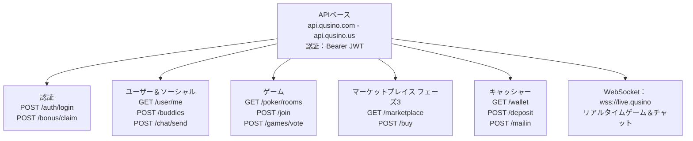

## 管理者ポータル – 完全統合

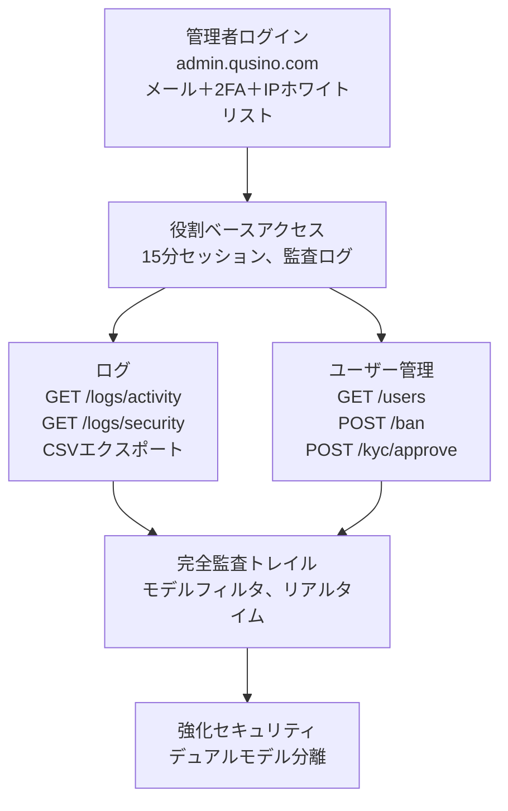

## 概要

QUBICブロックチェーン上の分散型ポーカールーム

## リリース

公開リリースなし

## パッケージ

公開パッケージなし

## フッター

© 2025 GitHub, Inc.

---

**翻訳完了**。  
すべてのテキスト、表、Mermaid図表のラベル、コードブロックを日本語に翻訳し、原文の構造・意味・ニュアンスを保持しました。