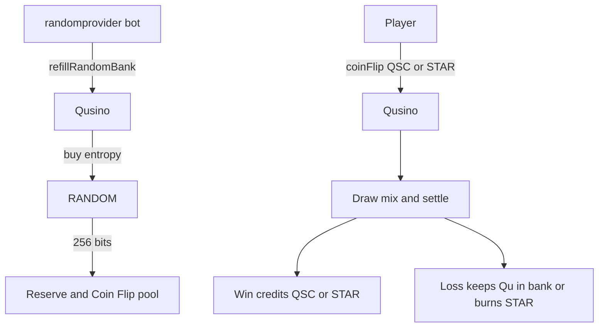

# Qubic Proposal: Qusino Upgrade — Coin Flip + RANDOM Result Bank

## Available Options

- **Option 0:** No — do not approve this Qusino upgrade.
- **Option 1:** Yes — approve the Qusino upgrade (Coin Flip game and RANDOM Result Bank) as specified in [core PR #998](https://github.com/qubic/core/pull/998).

---

## 1. Summary

This General Quorum Proposal asks Computors to approve a **logic-changing upgrade** of the existing **Qusino** smart contract.

The upgrade does two tightly coupled things:

1. Adds an on-contract **Coin Flip** game. Players bet **QSC** or **STAR** (never raw Qu) on heads or tails. Outcomes settle in the same procedure call.
2. Introduces a reusable **RNG Result Bank** that bulk-buys entropy from the **RANDOM** contract, expands it with K12, and serves instant draws from a per-game pool plus a shared overflow reserve. Individual bets therefore do **not** wait on a live `RANDOM` call.

The change is implemented in [qubic/core PR #998](https://github.com/qubic/core/pull/998) (`src/contracts/Qusino.h`, tests in `test/contract_qusino.cpp`, and a `PADDING` state-layout marker for `QUSINO_CONTRACT_INDEX` in `contract_def.h`). Core review has approved the integration shape; because contract **logic** changes, quorum approval is required before merge / inclusion.

Existing Qusino flows (STAR / QSC / QST, staking, game-proposal voting, epoch revenue split, daily claim bonus, QST sale/redemption) remain in place. `bonusAmount` is reused as the Qu bankroll that funds RANDOM refill fees and QSC win settlement.

---

## 2. Motivation

Qusino was accepted as a game-platform economy: in-platform assets, staking, community game proposals, and revenue sharing. It did not yet ship a first-party, instantly settling chance game that:

- uses the native **RANDOM** contract (the platform’s required fairness source),
- does not stall every bet on a fresh RANDOM invocation,
- keeps raw Qu off the betting surface (QSC and STAR only),
- can be extended later to Blackjack / Baccarat without another state-layout rewrite.

A naïve “call RANDOM per bet” design is too slow and too expensive for a casino UX. Pre-buying entropy into a Result Bank, then consuming and topping up slots, is the practical way to keep outcomes **provably sourced from RANDOM** while remaining **instant at bet time**.

Coin Flip is the smallest fair game that exercises the full path: buy entropy → mix with caller context → settle win/loss → refill the consumed slot. Shipping it now proves the bank before more complex table games land on the same plumbing.

---

## 3. Design goals

1. **Instant settlement** — a bet resolves in one user procedure; no pending RANDOM ticket for the player.
2. **RANDOM-backed, not computor-grindable at bet time** — entropy originates from RANDOM in bulk; each draw is context-mixed and re-hashed so a consumed value cannot be predicted or replayed.
3. **Reusable bank** — sized for up to 32 games (`QUSINO_RNG_MAX_GAMES`) with 1 active game at launch (`QUSINO_RNG_ACTIVE_GAMES`), so later titles do not need another padding / layout change for the bank itself.
4. **No raw-Qu wagers** — Coin Flip accepts QSC or STAR only.
5. **Solvency first** — a QSC bet is rejected unless the Qu bankroll can already cover the full win; wins cannot underflow `bonusAmount`.
6. **Capped bankroll** — deposits / loss top-ups that would push `bonusAmount` past `QUSINO_GAME_BANKROLL_CAP` (2.4B Qu) overflow into `epochRevenue`.
7. **Permissionless maintenance** — anyone may call `refillRandomBank()` subject to reserve-not-full and 5-tick rate-limit rules.
8. **Additive product surface** — new procedures / views / return codes; existing asset and staking APIs stay.

---

## 4. What changes (from PR #998)

### 4.1 RNG Result Bank

| Piece | Behavior |
|---|---|
| `refillRandomBank()` | Permissionless. Buys entropy from RANDOM in bulk (256 bits / call), expands it via K12 re-hashing into a **1024-entry shared reserve**, and bootstraps any not-yet-seeded game’s **256-entry pool** from that reserve. |
| Overwrite guard | Refill is **blocked** while the reserve still holds unspent values, so paid entropy is never discarded. |
| Rate limit | After a successful refill path is allowed, at most **once per 5 ticks**. |
| `getRandomBankStatus()` | Read-only view of pool / reserve health for frontends. |
| Sizing | `QUSINO_RNG_MAX_GAMES = 32` (headroom). `QUSINO_RNG_ACTIVE_GAMES = 1` at this upgrade (Coin Flip). |

Draw path for a bet:

1. Take a value from the game pool.
2. Mix with caller / bet context and re-hash so the raw bank slot is not the published outcome.
3. Consume the slot and top it up from the reserve.
4. If the pool or reserve is empty, the bet fails with `QUSINO_RNG_NOT_READY` (frontend should trigger or wait for `refillRandomBank`).

### 4.2 Coin Flip

| Piece | Behavior |
|---|---|
| `coinFlip(guess, assetType, amount)` | Guess heads or tails; `assetType` is QSC or STAR; `amount` ≥ minimum bet. |
| QSC win | Credits **new QSC** to the caller. Caller redeems to Qu later via existing `redemptionQSCToQubic`. Contract deducts the Qu value of the payout from `bonusAmount` at `QSC_PRICE`. |
| QSC loss | Qu value of the stake stays in / tops up the bankroll (`bonusAmount`), subject to the 2.4B cap (excess → `epochRevenue`). |
| STAR win | Mints STAR to the caller. Does **not** touch Qu / `bonusAmount`. |
| STAR loss | Burns STAR (same spirit as the existing vote-fee burn). |
| House edge | `QUSINO_COINFLIP_PAYOUT_PERCENT` = **1.96×** (~2% house edge). |
| Minimum bet | Reset in the PR to **3** (see commits “reset minimum betting amount as 3”). |

A QSC bet is rejected up front unless `bonusAmount` can cover the full win. That is the insolvency guard.

### 4.3 Bankroll (`bonusAmount`)

`bonusAmount` already backed the daily-claim-bonus feature. This upgrade **intentionally shares** that balance as the Qu bankroll for:

- RANDOM fees paid by `refillRandomBank()`,
- QSC Coin Flip payouts.

Funding path is the existing `depositBonus` (game owner). Cap:

- `QUSINO_GAME_BANKROLL_CAP` = **2,400,000,000 Qu**
- Any deposit or loss top-up that would exceed the cap is routed to **`epochRevenue`**.

Daily-claim-bonus and Coin Flip therefore draw from the same treasury. That is a design choice called out in the PR, not an accident.

### 4.4 New / reused return codes

New:

- `QUSINO_INVALID_INPUT`
- `QUSINO_RNG_NOT_READY`
- `QUSINO_RNG_REFILL_TOO_SOON`
- `QUSINO_RNG_REFILL_FAILED`

Reused where they already fit: `QUSINO_INSUFFICIENT_BONUS_AMOUNT`, `QUSINO_WRONG_ASSET_TYPE`, `QUSINO_INSUFFICIENT_QSC`, `QUSINO_INSUFFICIENT_STAR`.

### 4.5 State layout

`contract_def.h` records `{ QUSINO_CONTRACT_INDEX, PADDING, 231 }` (alongside the existing NOST migrate entry in the same table on that branch). Computors should treat this as a **state-layout change** that must land in a defined epoch via the normal core-release / construction process after a successful vote.

Exact construction epoch is set by core when the approved code is scheduled; this proposal authorizes **including this logic**, not a specific calendar epoch number.

---

## 5. User workflow

---

## 6. Testing (as stated on the PR)

40 GoogleTest cases in `contract_qusino.cpp` (up from 32), covering:

- bank refill success / failure / rate-limit / insufficient-bankroll,
- Coin Flip validation (bad guess, asset type, bet size, balances),
- QSC settlement (win credit, loss top-up, bankroll gating),
- STAR settlement (mint / burn, no bankroll interaction),
- bankroll cap and overflow-to-`epochRevenue`.

PR author reports all passing. Core reviewer (`fnordspace`) approved the integration **with the explicit note that core does not review contract game logic** and that the author must ensure the contract behaves as intended. Quorum approval is the governance step that authorizes shipping that logic.

---

## 7. Risks and mitigations

| Risk | Mitigation |
|---|---|
| Empty RNG bank → failed bets | Explicit `QUSINO_RNG_NOT_READY`; permissionless refill; frontend status view. |
| Wasted RANDOM fees | Refill refused while reserve still has unused values. |
| Refill spam | 5-tick rate limit + `QUSINO_RNG_REFILL_TOO_SOON`. |
| Bankroll insolvency on QSC wins | Reject bet unless `bonusAmount` covers full payout. |
| Unbounded bonus treasury | 2.4B Qu cap; excess to `epochRevenue`. |
| Shared bonus / game treasury | Documented; owner funds via `depositBonus`; daily bonus and Coin Flip compete for the same pool. |
| Predictable draws | Entropy from RANDOM; per-draw context mix + re-hash; consumed slots replaced from reserve. |
| Future games needing more state | Bank arrays already dimensioned for 32 games; only `QUSINO_RNG_ACTIVE_GAMES` needs bumping when a new title is proposed. |
| Logic bugs in payout math | 40 unit tests; 1.96× payout constant is explicit; minimum bet set to 3 in final commits. |

This upgrade does **not** move Qusino to raw-Qu table stakes. It does **not** change GQMPROP, CCF, or RANDOM themselves beyond Qusino calling RANDOM as a client.

---

## 8. Acceptance criteria

Vote **Yes (option 1)** if the following is acceptable:

1. Qusino may change user-visible logic to add Coin Flip and the Result Bank as described in PR #998.
2. `bonusAmount` may be shared between daily-claim-bonus and the game / RANDOM bankroll, capped at 2.4B Qu with overflow to epoch revenue.
3. Coin Flip may mint/burn STAR and credit/debit QSC as specified, with a ~2% house edge (1.96× payout) and minimum bet 3.
4. State padding / layout update for `QUSINO_CONTRACT_INDEX` may ship in the next core release that includes this PR after a successful vote.
5. No further scope (Blackjack, Baccarat, raw-Qu bets) is authorized by this proposal.

If any criterion fails, vote **No (option 0)**. A revised PR and proposal can follow.

---

## 9. References

- Implementation PR: https://github.com/qubic/core/pull/998
- Diff of contract source: https://github.com/qubic/core/pull/998/changes#diff-ded22da873f9c5eb2df95bf335fe7d61cb3882eeda1060c7c70804d180085c51
- Original Qusino inclusion PR: https://github.com/qubic/core/pull/762
