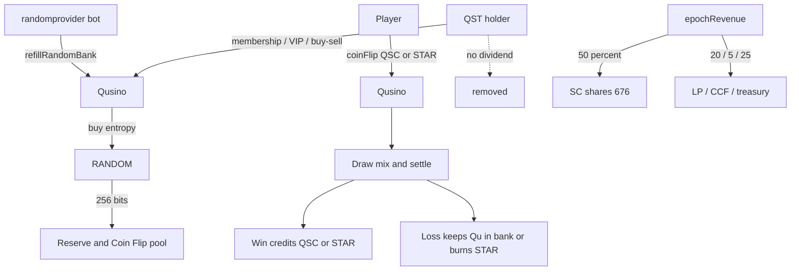

# Qubic Proposal: Qusino Upgrade — Coin Flip + RANDOM Result Bank + QST Membership Role

## Available Options

- **Option 0:** No — do not approve this Qusino upgrade.
- **Option 1:** **Yes** — approve the Qusino upgrade (Coin Flip game, RANDOM Result Bank, removal of QST dividends, and reallocation of the former QST revenue slice to SC shares) as specified in [core PR #998](https://github.com/qubic/core/pull/998) plus the QST / revenue changes described here.

---

## 1. Summary

This General Quorum Proposal asks Computors to approve a **logic-changing upgrade** of the existing **Qusino** smart contract.

The upgrade does four tightly coupled things:

1. Adds an on-contract **Coin Flip** game. Players bet **QSC** or **STAR** (never raw Qu) on heads or tails. Outcomes settle in the same procedure call.
2. Introduces a reusable **RNG Result Bank** that bulk-buys entropy from the **RANDOM** contract, expands it with K12, and serves instant draws from a per-game pool plus a shared overflow reserve. Individual bets therefore do **not** wait on a live `RANDOM` call.
3. **Removes epoch-revenue dividends to QST holders.** QST is no longer a revenue-share instrument. It is used **solely as a Membership / VIP token** (tiered access and perks; sale/redemption inventory may remain).
4. **Reassigns the former 30% QST slice of `epochRevenue` to Qusino SC shares.** `qpi.distributeDividends` receives that 30% in addition to the existing 20% shareholder slice, so SC shareholders receive **50%** of snapshotted epoch revenue. LP (20%), CCF (5%), and treasury (25%) are unchanged.

**Why the QST change.** QST dividends created a yield / investment profile on a token that also gates a chance-game platform. To keep Qusino operable under the gambling and securities rules of the **targeted jurisdictions**, QST must not pay protocol dividends. Membership / VIP utility only is the intended legal posture. This proposal does not give legal advice; it records that product constraint as the governance reason for the cut.

The Coin Flip / Result Bank change is implemented in [qubic/core PR #998](https://github.com/qubic/core/pull/998) (`src/contracts/Qusino.h`, tests in `test/contract_qusino.cpp`). Because the contract state struct changes, `contract_def.h` registers a **RESET** for `QUSINO_CONTRACT_INDEX` (not PADDING): `{ QUSINO_CONTRACT_INDEX, RESET, 232 }`. RESET discards the saved Qusino state and zero-fills the buffer. Core review has approved the integration shape; because contract **logic** (and state handling) change, quorum approval is required before merge / inclusion.

Existing flows that remain after the reset and re-init path: STAR / QSC mechanics, QST **sale and redemption** (inventory, not yield), game-proposal voting, daily claim bonus, and epoch revenue to **LP, CCF, treasury, and Qusino SC shareholders**. What does **not** remain: the QST holder dividend loop.

`bonusAmount` is reused as the Qu bankroll that funds RANDOM refill fees and QSC win settlement.

---

## 2. Motivation

Qusino was accepted as a game-platform economy: in-platform assets, community game proposals, and revenue sharing. It did not yet ship a first-party, instantly settling chance game that:

- uses the native **RANDOM** contract (the platform’s required fairness source),
- does not stall every bet on a fresh RANDOM invocation,
- keeps raw Qu off the betting surface (QSC and STAR only),
- can be extended later to Blackjack / Baccarat without another state-layout rewrite.

A naïve “call RANDOM per bet” design is too slow and too expensive for a casino UX. Pre-buying entropy into a Result Bank, then consuming and topping up slots, is the practical way to keep outcomes **provably sourced from RANDOM** while remaining **instant at bet time**.

Coin Flip is the smallest fair game that exercises the full path: buy entropy → mix with caller context → settle win/loss → refill the consumed slot. Shipping it now proves the bank before more complex table games land on the same plumbing.

**QST role — legality in targeted jurisdictions.** QST was both a membership token and a 30% revenue-share claim on `epochRevenue` (`QUSINO_QST_HOLDERS_DIVIDENDS_PERCENT`). That combination looks like an investment contract plus a casino-access token. In the jurisdictions Qusino is targeting, that mix is the wrong shape: protocol yield on the same asset that unlocks wagering creates avoidable securities and gambling-product risk.

This upgrade therefore:

- stops all QST holder dividends;
- keeps QST as **Membership / VIP only** (Player’s Card / tiered perks; optional buy/sell inventory);
- moves the 30% that used to go to QST holders onto the **676 Qusino SC shares**, which already receive contract dividends through the normal Qubic shareholder path.

SC shareholder dividends via `qpi.distributeDividends` remain the only on-contract revenue claim tied to “shares,” and they attach to IPO shares, not to QST.

---

## 3. Design goals

1. **Instant settlement** — a bet resolves in one user procedure; no pending RANDOM ticket for the player.
2. **RANDOM-backed, not computor-grindable at bet time** — entropy originates from RANDOM in bulk; each draw is context-mixed and re-hashed so a consumed value cannot be predicted or replayed.
3. **Reusable bank** — sized for up to 32 games (`QUSINO_RNG_MAX_GAMES`) with 1 active game at launch (`QUSINO_RNG_ACTIVE_GAMES`), so later titles do not need another state-layout change for the bank itself.
4. **No raw-Qu wagers** — Coin Flip accepts QSC or STAR only.
5. **Solvency first** — a QSC bet is rejected unless the Qu bankroll can already cover the full win; wins cannot underflow `bonusAmount`.
6. **Capped bankroll** — deposits / loss top-ups that would push `bonusAmount` past `QUSINO_GAME_BANKROLL_CAP` (2.4B Qu) overflow into `epochRevenue`.
7. **Permissionless maintenance** — anyone may call `refillRandomBank()` subject to reserve-not-full and 5-tick rate-limit rules.
8. **Additive product surface** — new procedures / views / return codes; existing non-dividend QST APIs stay.
9. **QST = membership only** — no QST holder dividend; QST utility is access / VIP, not a yield claim.
10. **Jurisdiction-safe token shape** — QST must not look like a dividend security in targeted markets; the 30% revenue slice moves to SC shares instead.

---

## 4. What changes (from PR #998 + QST / revenue change)

### 4.1 RNG Result Bank

| Piece | Behavior |
| --- | --- |
| `refillRandomBank()` | Permissionless. Buys entropy from RANDOM in bulk (256 bits / call), expands it via K12 re-hashing into a **1024-entry shared reserve**, and bootstraps any not-yet-seeded game’s **256-entry pool** from that reserve. |
| Overwrite guard | Refill is **blocked** while the reserve still holds unspent values, so paid entropy is never discarded. |
| Rate limit | After a successful refill path is allowed, at most **once per 5 ticks**. |
| `getRandomBankStatus()` | Read-only view of pool / reserve health for frontends. |
| Sizing | `QUSINO_RNG_MAX_GAMES = 32` (headroom). `QUSINO_RNG_ACTIVE_GAMES = 1` at this upgrade (Coin Flip). |

Draw path for a bet:

1. Take a value from the game pool.
2. Mix with caller / bet context and re-hash so the raw bank slot is not the published outcome.
3. Consume the slot and top it up from the reserve.
4. If the pool or reserve is empty, the bet fails with `QUSINO_RNG_NOT_READY` (frontend should trigger or wait for `refillRandomBank`).

### 4.2 Coin Flip

| Piece | Behavior |
| --- | --- |
| `coinFlip(guess, assetType, amount)` | Guess heads or tails; `assetType` is QSC or STAR; `amount` ≥ minimum bet. |
| QSC win | Credits **new QSC** to the caller. Caller redeems to Qu later via existing `redemptionQSCToQubic`. Contract deducts the Qu value of the payout from `bonusAmount` at `QSC_PRICE`. |
| QSC loss | Qu value of the stake stays in / tops up the bankroll (`bonusAmount`), subject to the 2.4B cap (excess → `epochRevenue`). |
| STAR win | Mints STAR to the caller. Does **not** touch Qu / `bonusAmount`. |
| STAR loss | Burns STAR (same spirit as the existing vote-fee burn). |
| House edge | `QUSINO_COINFLIP_PAYOUT_PERCENT` = **1.96×** (~2% house edge). |
| Minimum bet | Reset in the PR to **3** (see commits “reset minimum betting amount as 3”). |

A QSC bet is rejected up front unless `bonusAmount` can cover the full win. That is the insolvency guard.

### 4.3 Bankroll (`bonusAmount`)

`bonusAmount` already backed the daily-claim-bonus feature. This upgrade **intentionally shares** that balance as the Qu bankroll for:

- RANDOM fees paid by `refillRandomBank()`,
- QSC Coin Flip payouts.

Funding path is the existing `depositBonus` (game owner). Cap:

- `QUSINO_GAME_BANKROLL_CAP` = **2,400,000,000 Qu**
- Any deposit or loss top-up that would exceed the cap is routed to **`epochRevenue`**.

Daily-claim-bonus and Coin Flip therefore draw from the same treasury. That is a design choice called out in the PR, not an accident.

### 4.4 QST: no dividends, Membership / VIP only

**Legal reason.** Targeted jurisdictions treat a token that both (a) unlocks a chance-game product and (b) pays holders a share of platform revenue as a high-risk hybrid. Removing QST dividends is the on-contract way to keep QST as an **access / membership** asset only.

**Before.** `END_EPOCH` paid 30% of snapshotted `epochRevenue` pro-rata to every QST possessor (`QUSINO_QST_HOLDERS_DIVIDENDS_PERCENT`, `AssetPossessionIterator` on the QST asset).

**After.** That loop is **removed**. QST possessors receive **zero** epoch-revenue Qu from Qusino. `QUSINO_QST_HOLDERS_DIVIDENDS_PERCENT` is **0** (delete or leave unused).

**QST that continues:**

- Membership / VIP: holdings remain the on-chain signal for Player’s Card / tiered perks.
- `depositQSTForSale` / buy QST / sell QST at the fixed sale price (inventory / membership purchase, not a dividend).
- QST is **not** a Coin Flip wager asset (QSC or STAR only).

**Not QST:**

- Qusino SC shareholder dividends — 676 IPO shares only.

### 4.5 Epoch revenue split (30% moves to SC shares)

| Recipient | Before | After this proposal |
| --- | --- | --- |
| LP (`LPDividendsAddress`) | 20% | 20% |
| CCF (`CCFDividendsAddress`) | 5% | 5% |
| Treasury (`treasuryAddress`) | 25% | 25% |
| Qusino SC shareholders (676) | 20% | **50%** (20% + former 30%) |
| QST token holders | 30% | **0%** |

Implementation: `QUSINO_SHAREHOLDERS_DIVIDENDS_PERCENT` becomes **50**, and `qpi.distributeDividends` is called with

`div(smul(smul(epochSnapshot, 50ULL), 1ULL), 67600ULL)`

per share (same 676-share denominator pattern as today). LP / CCF / treasury math is unchanged. After these four transfers, the QST iterator must not run. Percentages still sum to 100%.

### 4.6 New / reused return codes

New:

- `QUSINO_INVALID_INPUT`
- `QUSINO_RNG_NOT_READY`
- `QUSINO_RNG_REFILL_TOO_SOON`
- `QUSINO_RNG_REFILL_FAILED`

Reused where they already fit: `QUSINO_INSUFFICIENT_BONUS_AMOUNT`, `QUSINO_WRONG_ASSET_TYPE`, `QUSINO_INSUFFICIENT_QSC`, `QUSINO_INSUFFICIENT_STAR`.

No return code is required for “QST dividend removed”; that path does not run.

### 4.7 State handling: RESET

This upgrade does **not** use a `PADDING` entry for Qusino.

`contract_def.h` records:

`{ NOST_CONTRACT_INDEX, MIGRATE, 230 }, { QUSINO_CONTRACT_INDEX, RESET, 232 }`

In core terms:

- **PADDING** keeps old saved bytes and zero-fills only new tail bytes (struct grew; old fields preserved).
- **RESET** discards the saved state entirely and zeros the whole buffer.

Qusino uses **RESET**. Pre-upgrade on-contract Qusino state (maps, lists, `bonusAmount`, `epochRevenue`, RNG bank, etc.) is **not** migrated field-by-field. It is wiped at the change epoch recorded in that table (232 on the current PR branch). Exact epoch is still set by core when the approved code is scheduled; this proposal authorizes **RESET + the new logic**, not a promise that the number will never be adjusted in the release commit.

After RESET, the contract runs with a clean buffer. Owner / operator setup that lived only in contract state (addresses, bonus deposit, sale inventory tracked in-contract, open game list, etc.) must be re-established through the existing procedures. QST, QSC, and STAR balances that live as Qubic assets outside that wiped struct are not themselves the RESET target; only Qusino’s contract state file is.

This proposal authorizes including that RESET with the new logic. It does not authorize a silent PADDING migrate of old Qusino fields.

---

## 5. User workflow

---

## 6. Testing (as stated on the PR)

40 GoogleTest cases in `contract_qusino.cpp` (up from 32), covering:

- bank refill success / failure / rate-limit / insufficient-bankroll,
- Coin Flip validation (bad guess, asset type, bet size, balances),
- QSC settlement (win credit, loss top-up, bankroll gating),
- STAR settlement (mint / burn, no bankroll interaction),
- bankroll cap and overflow-to-`epochRevenue`.

**Additional coverage required for the QST / split change** (same merge or a follow-on commit under this vote):

- `END_EPOCH` pays LP 20%, CCF 5%, treasury 25%, SC shareholders **50%**, and **does not** transfer Qu to QST possessors;
- shareholder `distributeDividends` input matches the 50% / 67600 formula;
- percentages sum to 100%; no leftover QST iterator side effects;
- QST sale and redemption still succeed;
- a wallet holding only QST receives no epoch Qu from Qusino.

PR author reports the Coin Flip / bank suite passing. Core reviewer (`fnordspace`) approved the integration **with the explicit note that core does not review contract game logic** and that the author must ensure the contract behaves as intended. Quorum approval is the governance step that authorizes shipping that logic, including QST dividend removal, the 50% SC-share split, and the Qusino **RESET**.

---

## 7. Risks and mitigations

| Risk | Mitigation |
| --- | --- |
| Empty RNG bank → failed bets | Explicit `QUSINO_RNG_NOT_READY`; permissionless refill; frontend status view. |
| Wasted RANDOM fees | Refill refused while reserve still has unused values. |
| Refill spam | 5-tick rate limit + `QUSINO_RNG_REFILL_TOO_SOON`. |
| Bankroll insolvency on QSC wins | Reject bet unless `bonusAmount` covers full payout. |
| Unbounded bonus treasury | 2.4B Qu cap; excess to `epochRevenue`. |
| Shared bonus / game treasury | Documented; owner funds via `depositBonus`; daily bonus and Coin Flip compete for the same pool. |
| Predictable draws | Entropy from RANDOM; per-draw context mix + re-hash; consumed slots replaced from reserve. |
| Future games needing more state | Bank arrays already dimensioned for 32 games; only `QUSINO_RNG_ACTIVE_GAMES` needs bumping when a new title is proposed. |
| Logic bugs in payout math | 40 unit tests; 1.96× payout constant is explicit; minimum bet set to 3 in final commits. |
| QST holders expected yield | Explicit product change for targeted-jurisdiction compliance; no silent cut. |
| Larger SC-share dividend (50%) | Same `distributeDividends` primitive; tests must check the 50/67600 rate. |
| Legal residual risk | QST has no dividend; membership only. This is not a legal opinion. |
| RESET wipes live Qusino state | Documented; not PADDING. Operator must re-fund `bonusAmount` and re-set in-contract config after the change epoch. Asset balances that are not in the Qusino state struct are out of scope of RESET. |

This upgrade does **not** move Qusino to raw-Qu table stakes. It does **not** change GQMPROP, CCF, or RANDOM themselves beyond Qusino calling RANDOM as a client. It does **not** burn, recall, or reprice existing QST; it stops using QST as a dividend asset.

---

## 8. Acceptance criteria

Vote **Yes (option 1)** if the following is acceptable:

1. Qusino may change user-visible logic to add Coin Flip and the Result Bank as described in PR #998.
2. `bonusAmount` may be shared between daily-claim-bonus and the game / RANDOM bankroll, capped at 2.4B Qu with overflow to epoch revenue.
3. Coin Flip may mint/burn STAR and credit/debit QSC as specified, with a ~2% house edge (1.96× payout) and minimum bet 3.
4. Qusino state may be **RESET** (not PADDING) via `{ QUSINO_CONTRACT_INDEX, RESET, 232 }` in `contract_def.h`, shipping in the core release that includes this PR after a successful vote. Saved Qusino contract state is discarded and zeroed; it is not a preserve-old-fields pad.
5. **QST holder dividends are removed** so QST is not a revenue-share token in targeted jurisdictions. `END_EPOCH` must not pay Qu to QST possessors.
6. QST is authorized only as a **Membership / VIP** token (perks; sale/redemption inventory). That limitation is the stated reason for (5).
7. The former **30% QST slice is paid to Qusino SC shareholders**, making the shareholder share **50%**. LP 20%, CCF 5%, treasury 25% unchanged. Totals 100%.
8. No further scope (Blackjack, Baccarat, raw-Qu bets, new QST yield scheme) is authorized by this proposal.

If any criterion fails, vote **No (option 0)**. A revised PR and proposal can follow.

---

## 9. References

- Implementation PR: https://github.com/qubic/core/pull/998
- Diff of contract source: https://github.com/qubic/core/pull/998/changes#diff-ded22da873f9c5eb2df95bf335fe7d61cb3882eeda1060c7c70804d180085c51
- State-change table on the PR: `{ QUSINO_CONTRACT_INDEX, RESET, 232 }` in `contract_def.h`
- Original Qusino inclusion PR: https://github.com/qubic/core/pull/762
- Current Qusino source (QST dividend loop, `QUSINO_QST_HOLDERS_DIVIDENDS_PERCENT = 30`, `QUSINO_SHAREHOLDERS_DIVIDENDS_PERCENT = 20`): https://github.com/qubic/core/blob/main/src/contracts/Qusino.h

---

This text records a product constraint for targeted jurisdictions. It is not legal advice and does not name specific statutes or regulators.